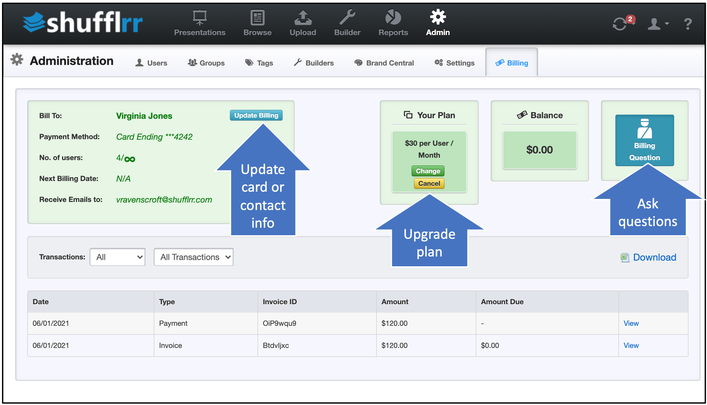
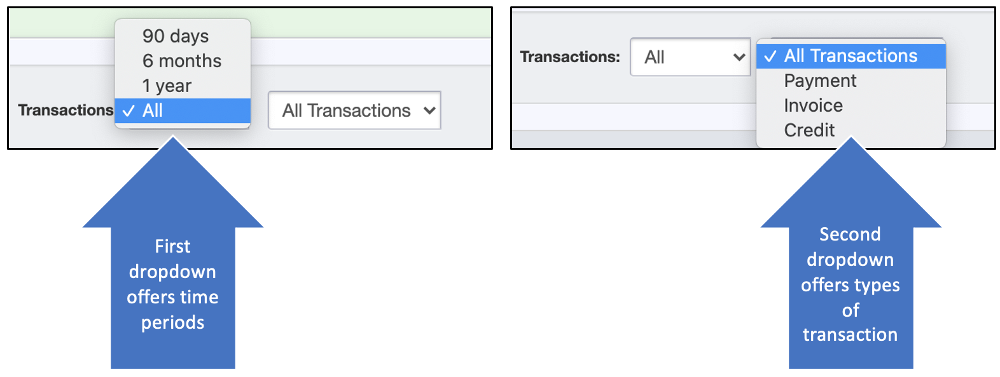
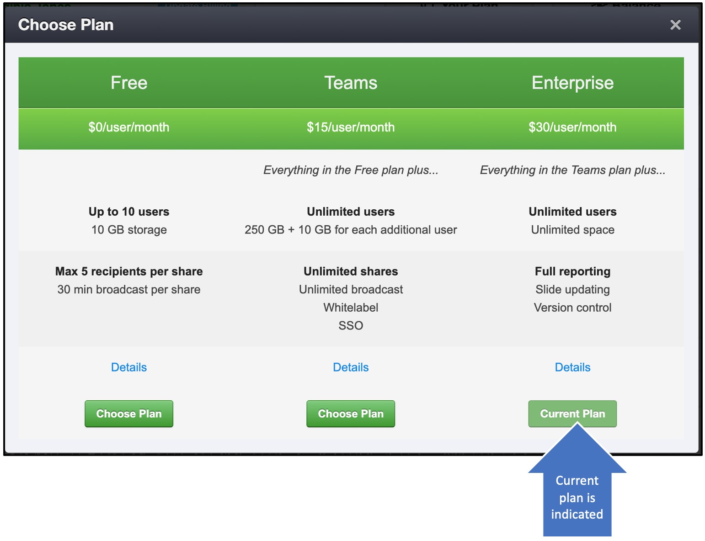

# Billing

## Why use the Billing screen? 

* Upgrade your plan
* Change credit card or contact information
* See past transactions and current status

## Steps

In the left box, the card and contact information and plan information is visible. The card and contact can be changed by clicking the "Update Billing" button. 

At right, your current balance due is shown, or you can click the "billing questions" button to easily get in touch with Shufflrr. 

At the bottom are your recent transactions. Using the dropdowns, you have the option to view different time periods and types of transactions. There's also an export feature. 

### Upgrade

To upgrade your plan, click "Change" under "Your Plan." You will see a selection of the available plans with their features, including an indicator of which one is your current plan. Click for more details or choose the one that works best for you by clicking "Choose Plan."

