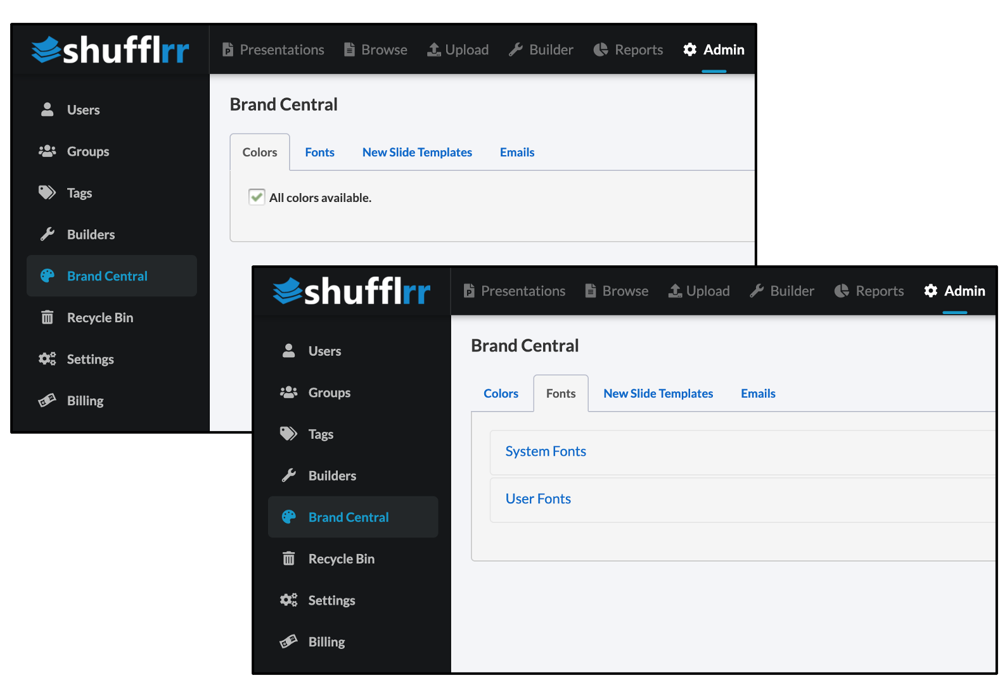
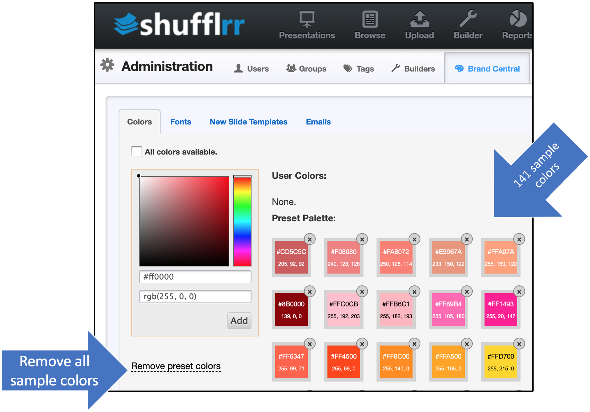
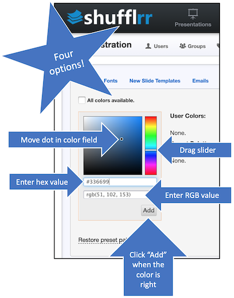
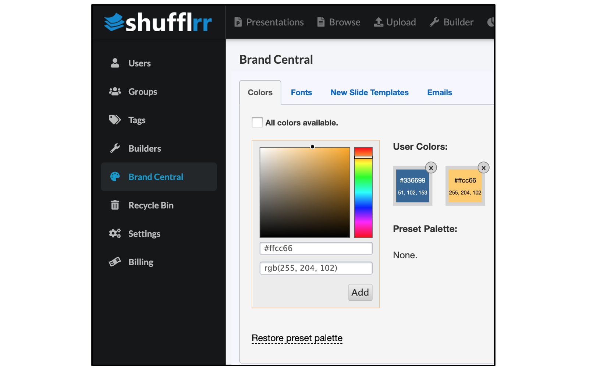
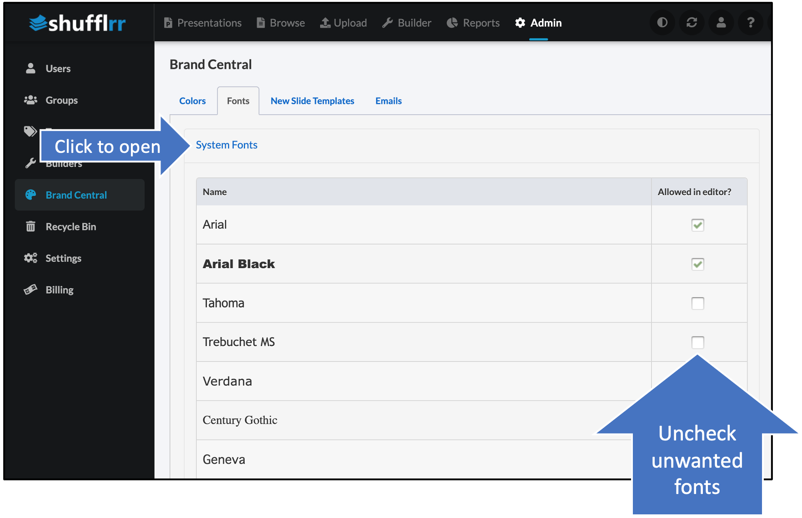
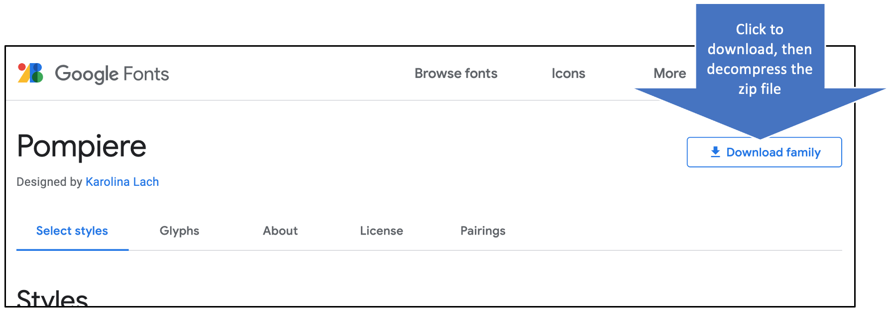
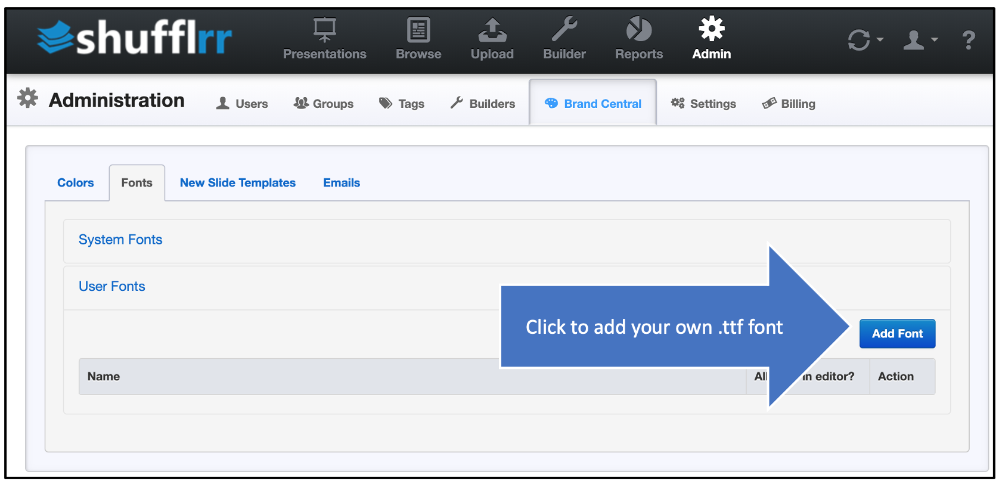
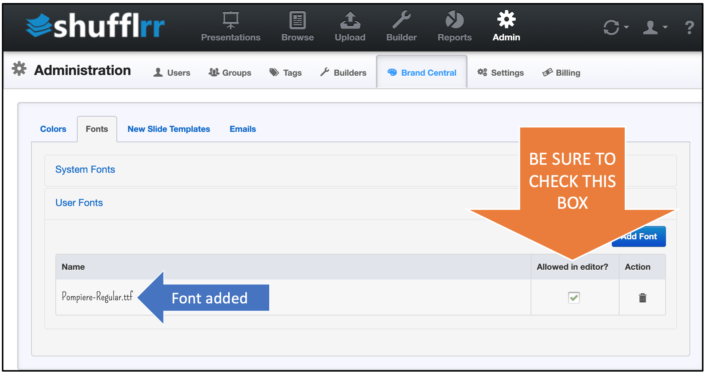
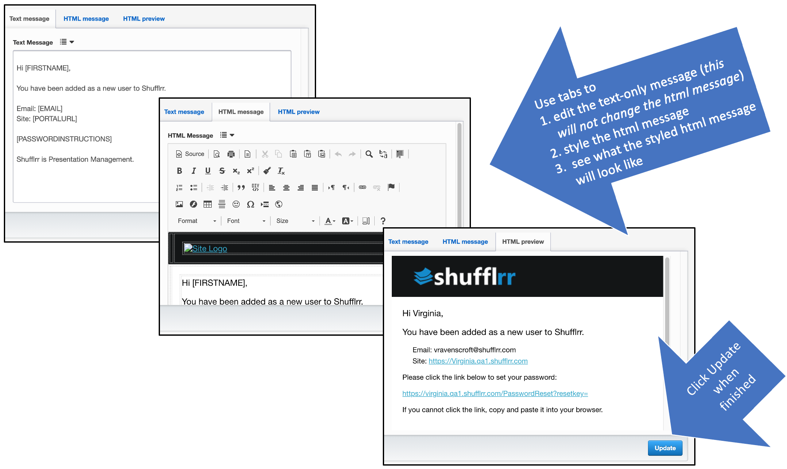

# Brand Central

## Why use Brand Central? 

When users create new content in Shufflrr, you want them to maintain your corporate identity by using corporate colors and fonts. Set these in "Brand Central" to ensure consistency and compliance. From this tab, you can also update the email templates that users receive. 

## Steps

Click the "Admin" icon and the "Brand Central" tab. The first three tabs are essentially empty when first opened. 

#### Colors

If you uncheck the box for all colors, you get 141 pre-set colors. Click "remove preset colors" to remove them so you can add your corporate branding.

There are **FOUR** options for entering new colors. Zero in on the color you want and click "Add."

Once you have your brand colors entered, they will appear to the right. 

#### Fonts

To select ***system fonts*** (commonly used fonts such as Arial, Tahoma, Trebuchet, etc.) as your corporate fonts, just click "System Fonts.” All fonts are available by default. If you don’t want a specific font, uncheck the box. Checked fonts are available; unchecked boxes are not.   

You can also ***upload your own fonts***. Shufflrr supports any TrueType fonts (.ttf files). 

For example, if you’re using a Google font, get the TrueType file (.ttf) for that font. You can do this by going to the page for that font and clicking "download font family." 

Double click on the .zip that downloads to extract it. Make sure you know where it is - you will need it in a minute!

Then, in Shufflrr, click "Add Font"...

Select the .ttf file from inside the folder that you extracted from the Google download.

Last step - IMPORTANT! Check the box to make this font available. 

 

#### Email templates

The last tab contains 20 email templates. You can modify the text and/or styling according to your wishes. 

