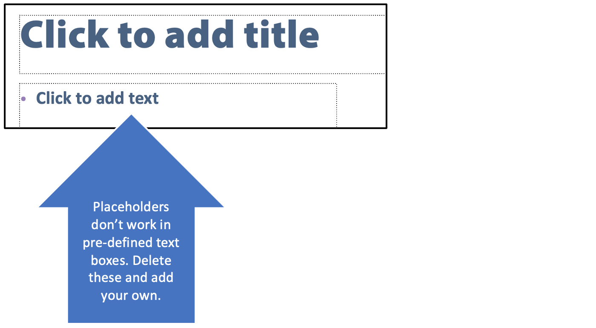

# Builders

## Why use Builders? 

Builders are used when you want to *pre-define* a deck. 
* Allow only a few customizable fields
* Disallow other editing

You can also use builders to link sets of slides together to be incorporated into child decks as a unit - for example, product slides and their disclaimer text. 

For the user's perspective, [see the section for users of builders](builder.md).

## Steps

### 1. Create a deck to be used as a builder. 

Anywhere you want a customizable field: 
* Add a placeholder in brackets, such as, [name] or [date]
* The text box *cannot* be out of the PowerPoint template (a box that is on the slide when it is created - the box that says "Click to add text"); it must be *added by you*. 
* The text can be formatted - it will keep the formatting.

### 2. Upload the deck to Shufflrr.

See the [Uploading](presentations-uploading.md) page for more information.

### 3. Create a new template (builder) in Shufflrr. 

* Enter the name.
* Add a looping video and a separate title slide, if desired
* Add the placeholder names 
	* Important: they must EXACTLY match the deck
	* Press a comma or space after each one to create the item
* Add the deck you created in step 1 (be sure to click "Add"!)
* Be sure to give permissions
* Optional: limit the number of slides users can add 
	* To prevent them from adding any, enter the number of slides in the Foundation deck, as shown here.

* Once you have added your first presentation to the template, you can always add additional presentations by clicking the "Add" button by the saved presentation. 
* You can nest and add as many presentations as desired. 
* They will each be an option for users to add to their final deck
* Users can customize and build precisely what is needed. 

 

### 4. What the user sees

When the user selects the "Builder" tab and selects the template you have just created, they will see: 
* Spaces for the placeholders to be filled in
* The option to choose any/all of the presentations you have added. 

When the user fills in the placeholders text, they will not be reflected in the preview or tray, but once they save the presentation, the placeholders will be replaced with the user's custom text. 

Here is what the presentation looks like once saved: 

