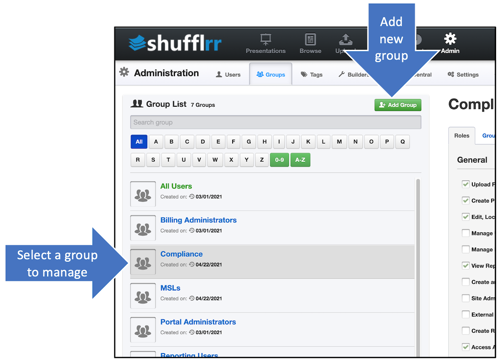
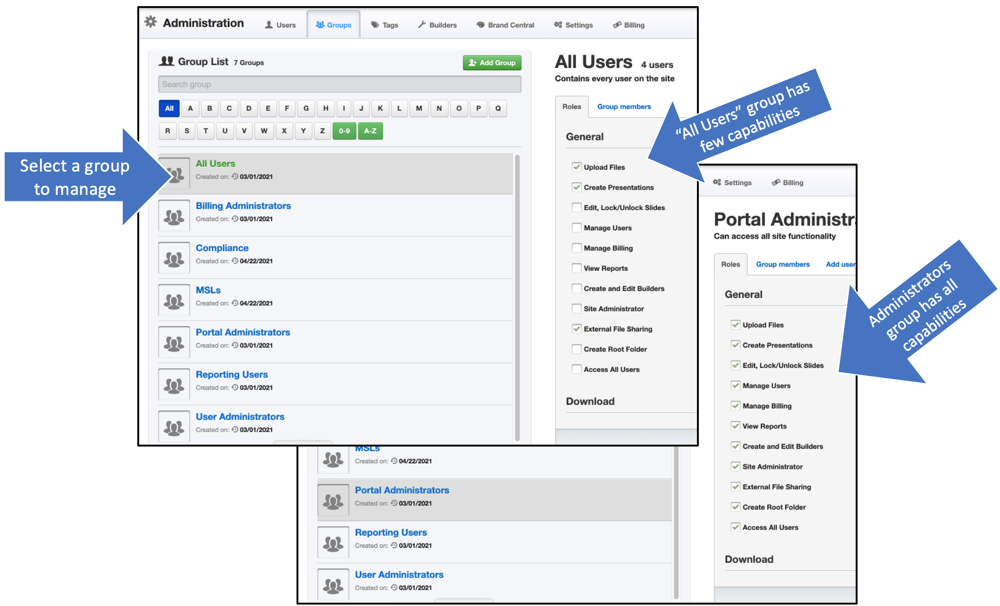

# Admin: Groups
##  Why use the Groups tab?

Groups management may seem complex at first but it's key to successful Presentation Management. 

Use this tab to: 
* Create groups that you can assign permissions to 
* Manage groups by adding and deleting users
* Manage site-wide group roles 

## Steps 
Click "Admin" and "Groups" to see the tab. 

On the left side of the tab is a list of groups. Select one to manage or create a new one. 

Once a group is created/selected, assign site-wide capabilities ("roles") to that group. 

>**Pro tip!**
>
> If you want users to have certain capabilities in one folder, but not in another, you manage that in _[folder permissions](presentations-permissions.md)_. The capabilities here are for the entire site. 

