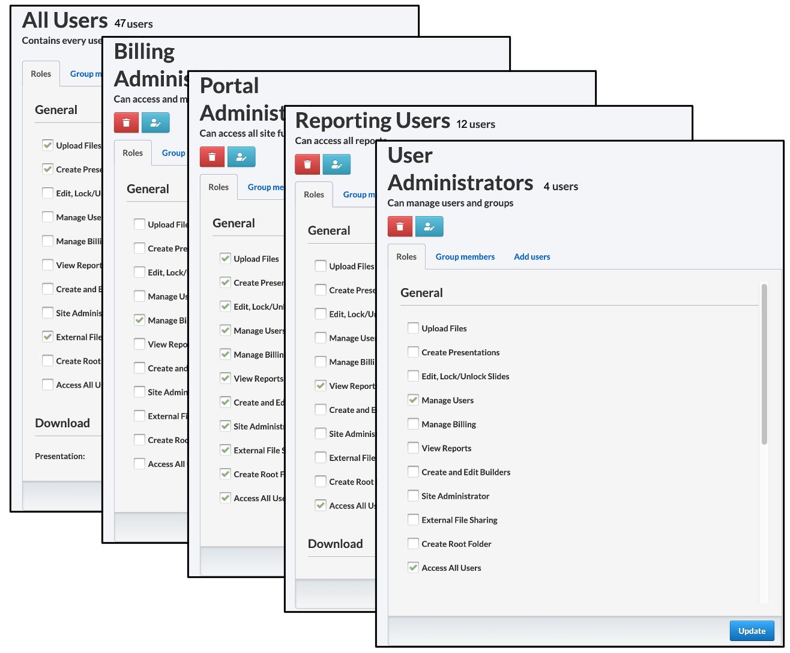
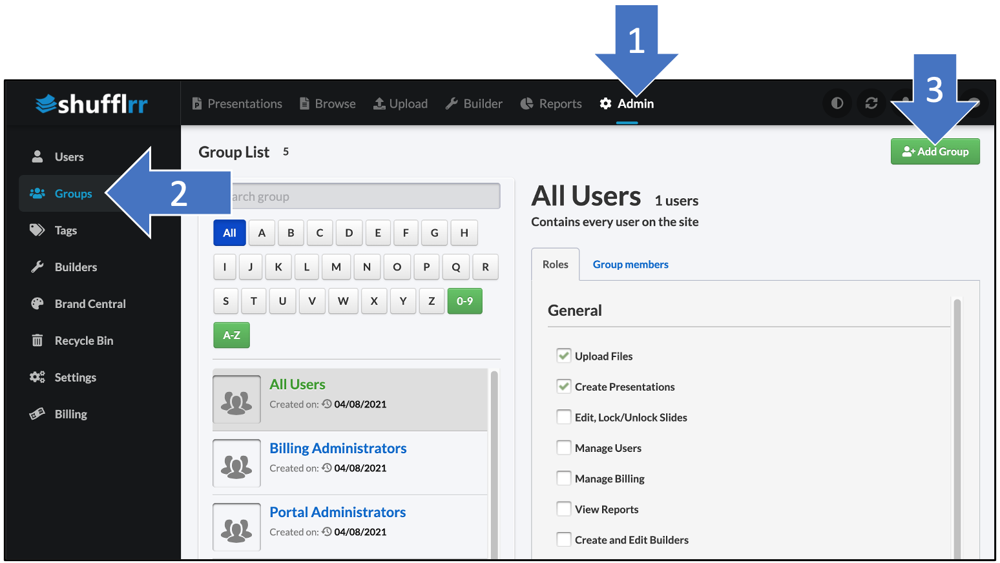

# Admin: Groups

<iframe width="560" height="315" src="https://www.youtube-nocookie.com/embed/jAvwPDwSxgk" title="YouTube video player" frameborder="0" allow="accelerometer; autoplay; clipboard-write; encrypted-media; gyroscope; picture-in-picture" allowfullscreen></iframe>

##  Why use the Groups tab?
Groups management may seem complex at first but it's key to successful Presentation Management. 

Use this tab to: 
* Create groups that you can assign permissions to 
* Manage groups by adding and deleting users
* Manage site-wide group roles 

## Steps 
Click "Admin" and "Groups" to see the tab. 

When your Shufflrr site is first set up, there are five existing groups: 
* All Users 
* Billing Administrators
* Portal Administrators
* Reporting Users
* User Administrators

Each one has specific roles (capabilities) on your Shufflrr site. 

All of these can be modified or deleted, except that the "All Users" group cannot be deleted. This is the group that has all site users as members, by default. 

>**Pro Tip!**
> 
> If a user is a member of multiple groups, they have **all** the roles from **all** the groups. So, removing roles from "All Users" does not affect users' roles from the other groups they belong to.  

#### Creating new groups

Go to the groups tab & click "Add Group." 

Once you have saved your group, you are automatically taken to the group settings. Check off the roles you would like for this group overall (not in reference to a folder yet). 

Click the "Add Users" tab and add users.

 

>**Pro tip!**
>
> If you want users to have certain capabilities in one folder, but not in another, you manage that in _[folder permissions](presentations-permissions.md)_. The capabilities here are for the entire site. 

