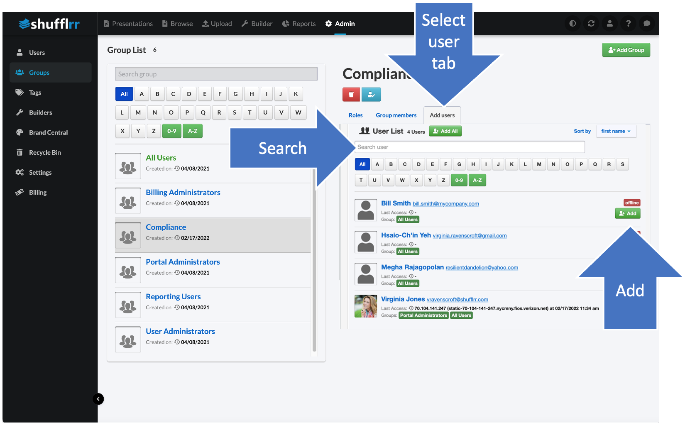

# Admin: Groups

<iframe width="560" height="315" src="https://www.youtube-nocookie.com/embed/jAvwPDwSxgk" title="YouTube video player" frameborder="0" allow="accelerometer; autoplay; clipboard-write; encrypted-media; gyroscope; picture-in-picture" allowfullscreen></iframe>

##  Why use the Groups tab?
Groups management may seem complex at first but it's key to successful Presentation Management. 

Use this tab to: 
* Create groups that you can assign permissions to 
* Manage groups by adding and deleting users
* Manage site-wide group roles 

## Steps 
Click "Admin" and "Groups" to see the tab. 

When your Shufflrr site is first set up, there are five existing groups: 
* All Users 
* Billing Administrators
* Portal Administrators
* Reporting Users
* User Administrators

Each one has specific roles (capabilities) on your Shufflrr site. See [below](#more-about-roles) for more on roles. 

All of these can be modified or deleted, except that the "All Users" group cannot be deleted. This is the group that has all site users as members, by default. 

>**Pro Tip!**
> 
> If a user is a member of multiple groups, they have **all** the roles from **all** the groups. So, removing roles from "All Users" does not affect users' roles from the other groups they belong to.  

### Creating new groups

Go to the groups tab & click "Add Group." 

Once you have saved your group, you are automatically taken to the group settings. Check off the roles you would like for this group overall (not in reference to a folder yet). 

Click the "Add Users" tab and add users.

 

>**Pro tip!**
>
> If you want users to have certain capabilities in one folder, but not in another, you manage that in _[folder permissions](presentations-permissions.md)_. The capabilities associated with *groups* are for the entire site. 

### More about roles

Here is a list of what each role allows users to do: 

* ***Upload files:*** Group members can upload content to Shufflrr. 
Note: They will only be allowed to upload content to folders where they have Write or Full Control permissions.  
* ***Create Presentations:*** Group members can drag and drop slides and files to create their own presentation from existing files.
* ***Edit, Lock/Unlock Slides:*** Group members can unlock a slide, edit it, and lock it again. Those without this privilege can only use existing slides, except in a few cases (such as builders, where a few editable words might be included on a presentation).
* ***Manage Users:*** Group members have ability to 
	* Add and remove users from Shufflrr
	* Create and delete Groups
	* Grant the type of roles we are discussing here
	* Edit any user's profile
	* Set up mandatory tags for a user
* ***Manage Billing:*** Group members can update the company's Shufflrr plan or change the billing card. 
* ***View Reports:*** Group members can access Shufflrr’s Reporting module, where they can then configure and download their custom reports
* ***Create and Edit Builders:*** Builders are Presentation Wizards where content is locked down. Users of builders can select topic(s) to be included and the presentation will be created for them.  It restricts the free-form drag-and-drop presentation creation flexibility. Read more about builders [here](admin-builders.md).  
* ***Site Administrator:*** Site Administrators have access to the Settings module, which is where you can make universal changes to the branding of your company's Shufflrr site, as well as several technical settings. 
* ***External File Sharing:*** Group members can share files outside of Shufflrr. Disable this if you want to be sure material is kept confidential within your company. The disadvantage is that if a coworker is not a Shufflrr user, they also will not be able to receive a share. 
* ***Create Root Folder:*** Turning this off prevents users from cluttering the company's site with  folders at the highest level. 
* ***Access All Users:*** Group members with this permission enabled can search for and include any user in their permissions, tags, etc. 
* ***Download:*** Determine what kind of files Group members are allowed to download.  You can limit Group members' ability to edit files by only allowing them to download a PPSX file, (which is a PowerPoint slide show) or a PDF file, or deny download all together.  If you would like to allow your Group to edit their presentations, then select PPTX.

