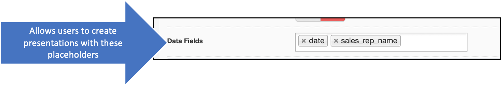

# Settings

## Why use settings? 

The settings tab allows the administrator to customize the company's Shufflrr site so that users get a corporate-branded experience with all of Shufflrr's capabilities configured to create exactly the site configuration that is appropriate for your needs. 

## Steps

There are quite a few sections to the settings tab. Click the "Admin" icon and the "Settings" tab to begin exploring. *Be sure to click "Save" at the very bottom of the page to preserve your work in this tab!* 

### Your company in Shufflrr

To set up your Shufflrr site to reflect your company's branding, set up the site with your company's logo and "favicon" (the little icon that appears in the browser tab for the site).

### Customize User Experience

The next section allows you to set what users see on logging in ("Home Page") and also, in the "Site Message" section, to customize the text / images that appear at the top of the "Presentations" page (the default homepage). 

> **Pro tip!**
> 
> Many companies use the "Site Message" space to provide information on internal resources to help users with Shufflrr, such as training materials and contact people - as in the example below.  

The next toggle indicates whether new users can request access. 

### Customize sharing

The following two options relate to sharing. (More info about sharing is [here](presentations-file-sharing.md)). First, indicate whether EXTERNAL shares are allowed. Second, create a default message to be used in Shares. 

>**Pro tip!**
> 
> This message can still be changed by the user. To incorporate a message that cannot be changed, use the ["Email Templates" functionality in the "Brand Central" tab](admin-brand-central.md#email-templates), specifically the ""FileShared" template.

### Authentication

The authentication section includes four options. 

* Many companies will use Shufflrr authentication, but, some desire a seamless interface where users who are already logged in to company software can move into Shufflrr without logging in again. 
* Salesforce integration is the easiest: the user need only find their *Salesforce Organization ID*, which can be found in Salesforce → Setup → Company Profile → Company Information. 
* SAML Single Sign-On is the most complex. Documentation can be found here: 
	* [ADFS (Microsoft Active Directory) documentation](https://shufflrr.com/assets/saml-adfs3.html)
	* [Okta documentation](https://shufflrr.com/assets/saml-okta.html)
* Last is OpenId. That documentation is [here](https://shufflrr.com/assets/openid-okta.html). 

### IP Address Whitelisting (Allow-listing)

### Presentations Settings

In the "Presentations" section, admins can limit the number of slides used. Admins can also allow or block automatic updating (see [Parent-Child Relationships](presentations-slide-inheritance.md) and [Parent-Child Updating](presentations-version-control.md) for more information on automatic updates). Allowing a Master Template is not recommended. 

#### Data fields

Data fields can be used to create placeholders on "Parent" presentations so that a number of "Child" presentations can quickly be made with different attributes in those placeholders. 

For example, this admin has created placeholders for Sales Rep Name and Date. 

Now, a user can upload a deck with text boxes with these fields, typed exactly the same way, enclosed in brackets. 

Then, when the user creates a new deck and saves, they have the option to enter text to be displayed in the placeholder field. 

The newly saved deck has the placeholders filled in. The deck with the placeholders is still in the slide tray. Click "Save" again to save with a different date and name. 

#### Mandatory slides

The last option in this section is to include mandatory slides. These might be a specially created title page or a section of compliance text that must be in every deck. 

For example, when a disclaimer slide is added here, it will show at the end of every saved deck; it will always be in the slide tray, and cannot be deleted or moved away from being the last slide. 

### User Defaults

This section allows the admin to configure the default notifications for all users. Users can also control these settings in their personal profile.  

