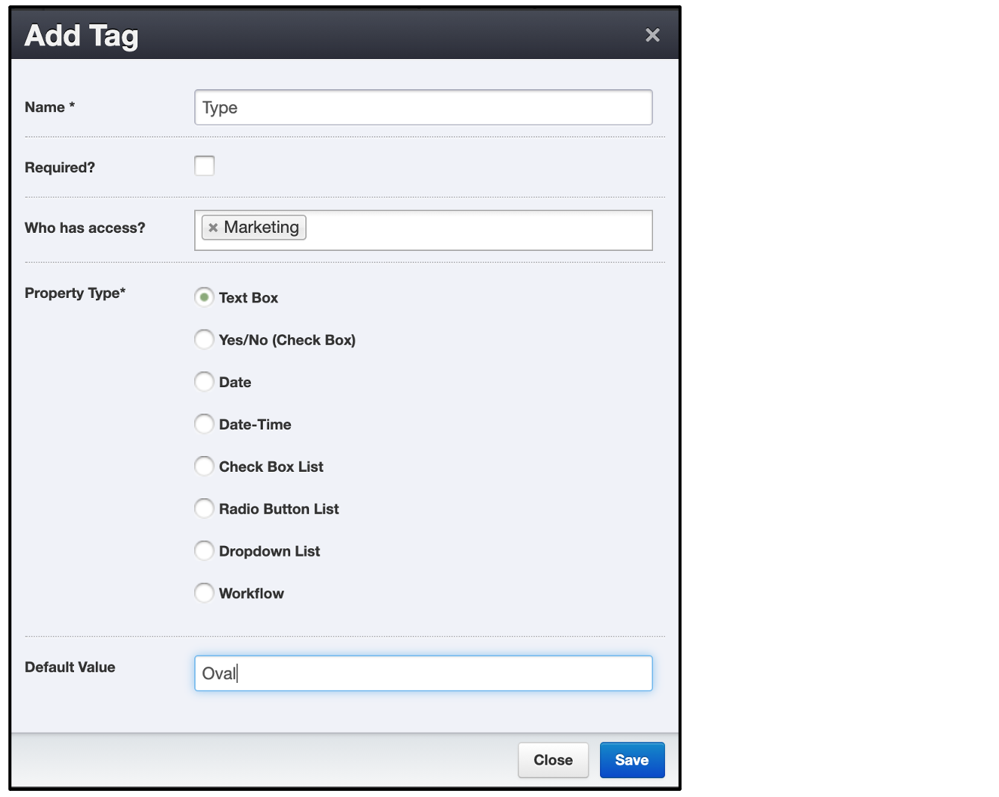
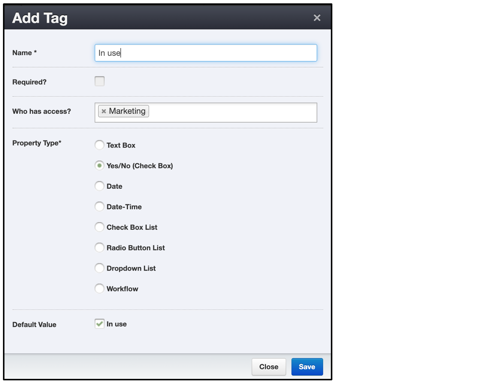
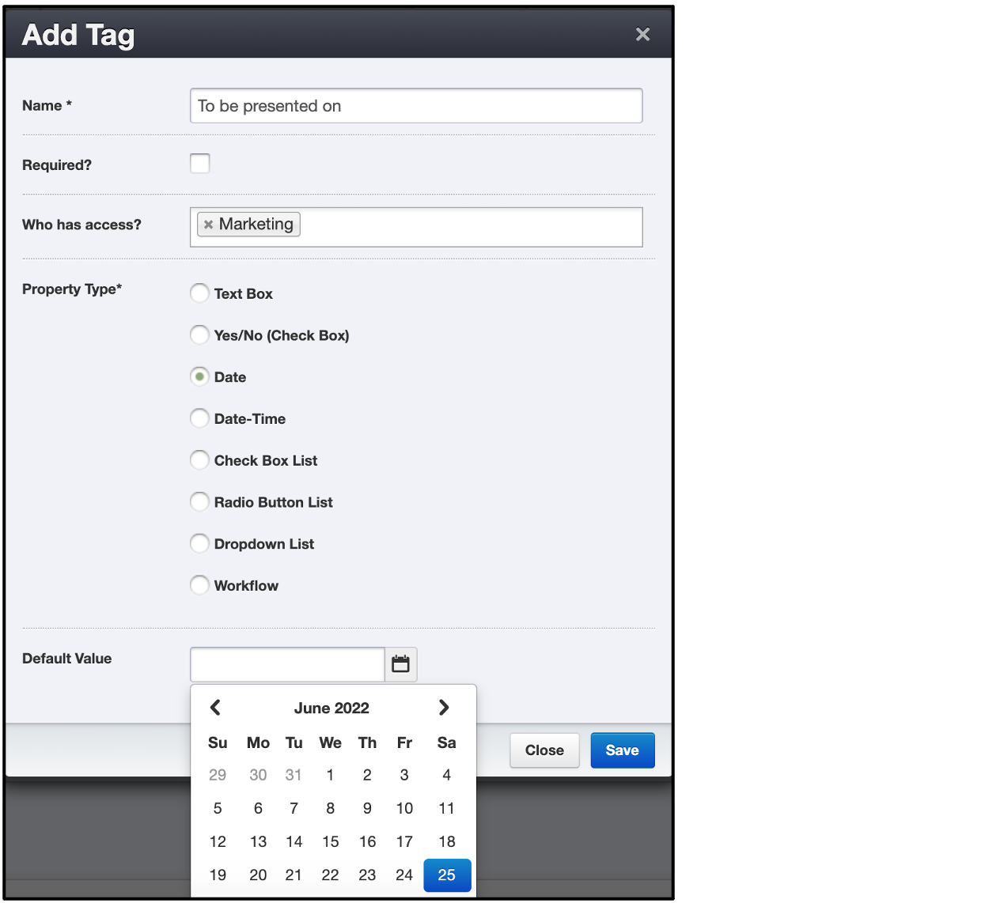
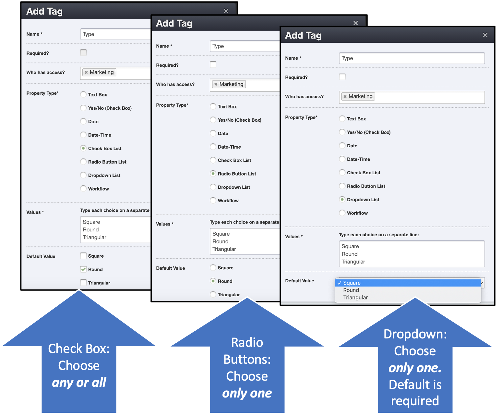
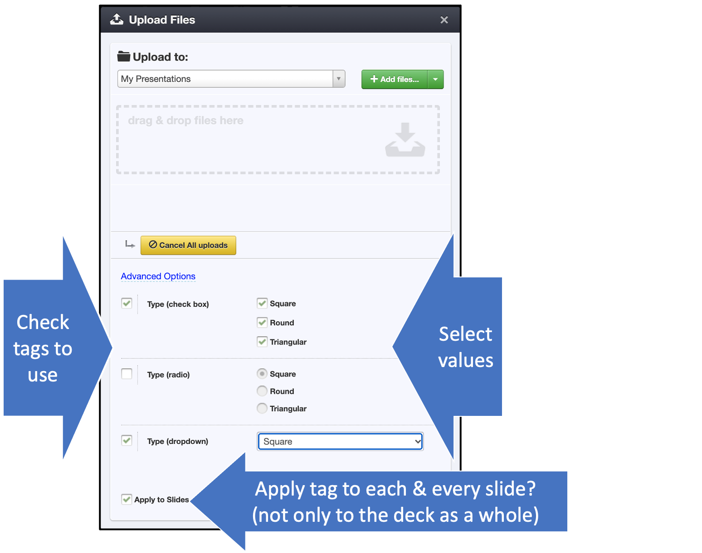
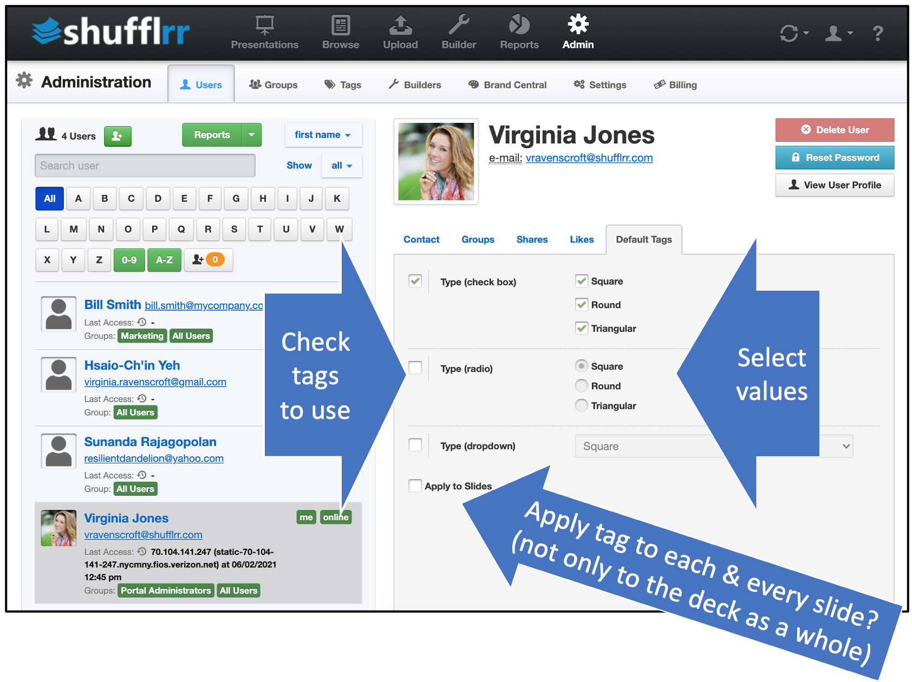

# Tags

## Why use tags? 

Users leverage tags in multiple different ways. Primarily, though, tags allow you to customize search.

## Steps

There are eight types of tags. For each one, you can (optionally) specify a default value that will be applied to all presentations unless a different value is selected. 

>**Pro Tip!**
> 
>When you add a new tag, and give it a default value, it immediately gets added to all existing presentations on the site. Use with care!  

#### Text box tags

Although this is the default, it is not recommended ***if searching is the goal***. The fact that users enter their own means that typos and small differences can impede searching by tags. 

#### Yes/No tags

This is the simplest tag. It allows only two options. 

#### Date & Date-Time tags

Suggestion: Use these tags to identify all presentations that are to be presented at a specific event or on a specific date.

#### Check Box List, Radio Button List, Dropdown List

These are the most commonly used tag options, because they represent a limited set of possible values and make it easy to search.

>**Pro Tips!**
>
>* Only "Check Box List" allows you to choose more than one option.
>* Only "Dropdown List" requires you to have a default choice.

### Using Tags

#### Uploading

When uploading, click "Advanced Options" and select tags that should apply to the presentation. If applicable, check to apply the tags to the individual slides, so that the tags will stay with them when they are used in different presentations. 

#### User Default Tags

To connect specific default tags to users, click "Admin" and go to the "Users" tab. Select a specific user and select the "Default Tags" tab. 

