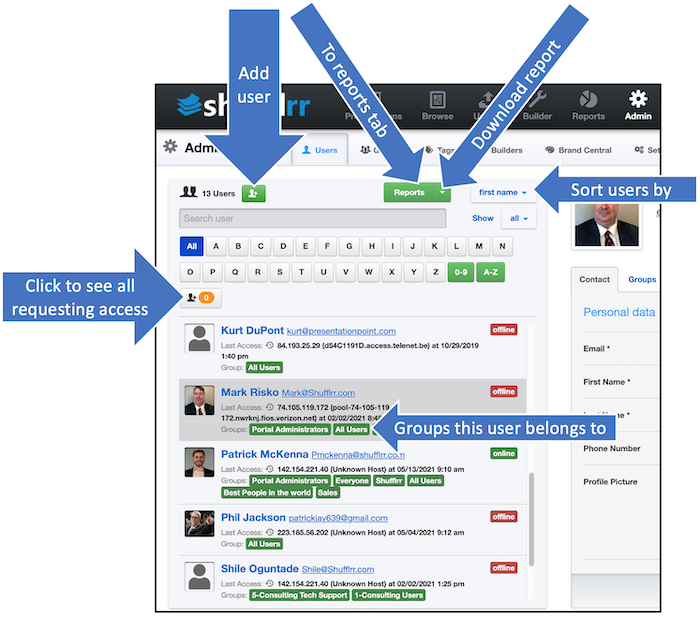
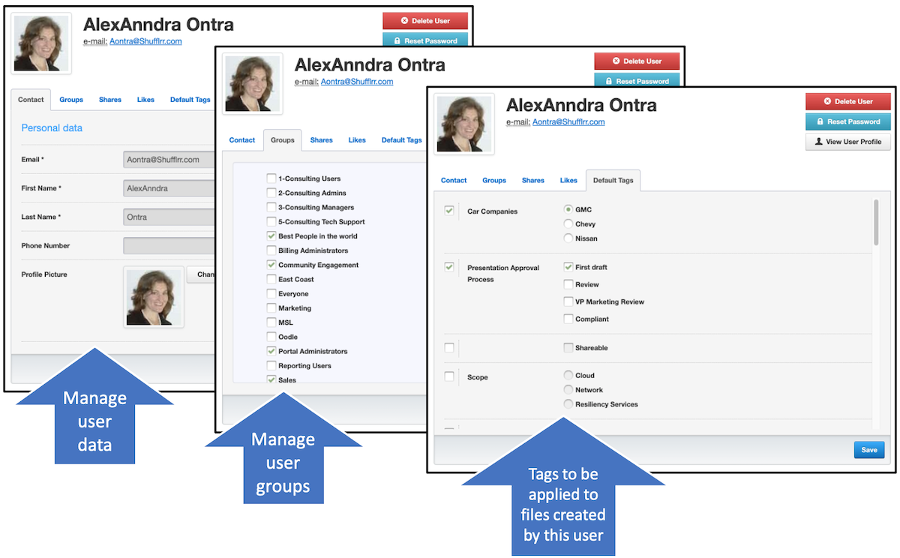
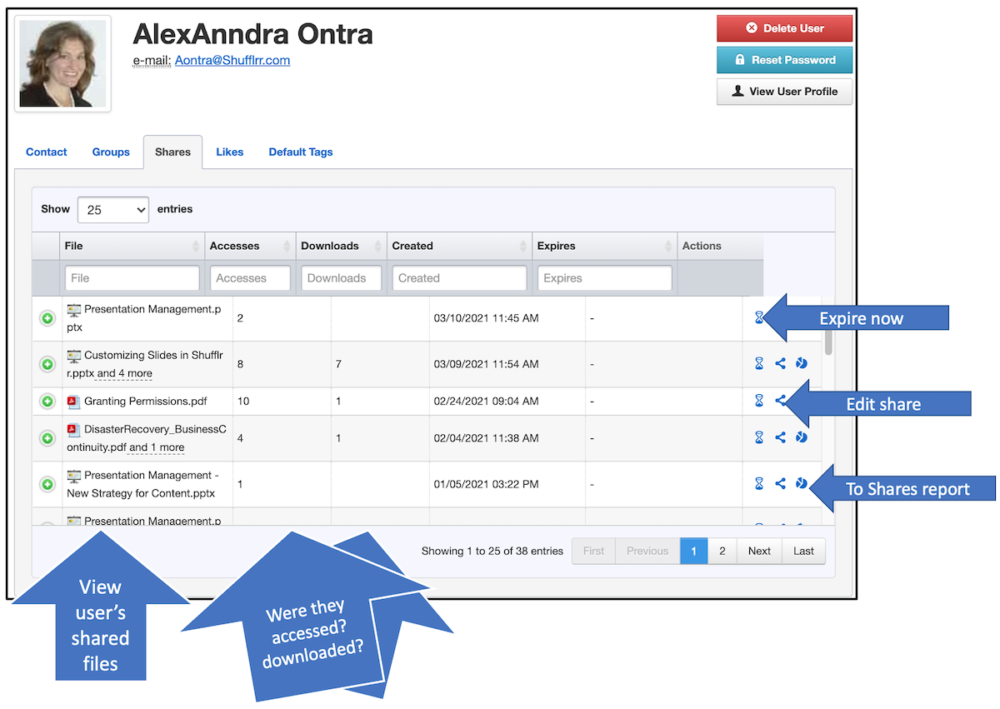
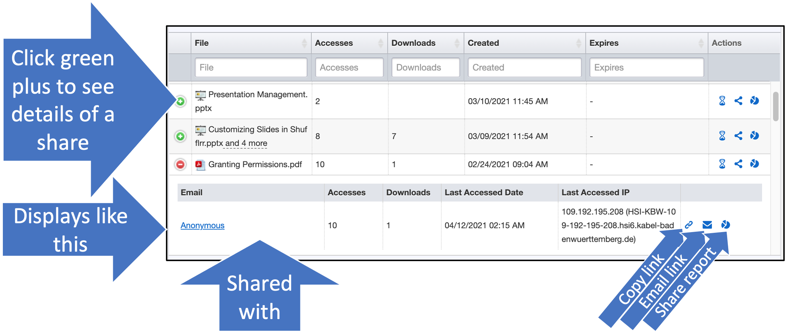
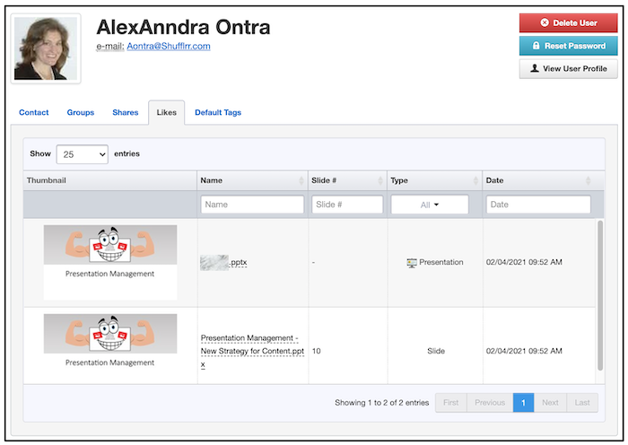

# Admin: Users
      
##  Why use the Users tab?

Presentation Management only works if there are users sharing and shuffling content. 

Use this tab to: 
* Review the list of users
* Manage (add, update, and delete) users
* Reset passwords
* See people who have requested access to the system, and admit/deny them
* Manage the groups and default tags for a user
* See some of the user's activity (shares and likes)

## Steps 
Click "Admin" and "Users" to see the tab. 

On the left side of the tab are tools for finding and working with users' basic information such as their groups and last access. You can also download the user report or go to it from here. 

Click on a name in the left panel to see that specific user displayed on the right. 
* Use the first and second tabs to manage that user's data and groups. 
* Use the Default Tags tab to associate specific tags with all content created by that user (for more information about tags, please see [Tags](admin-tags.md)).

#### Share reporting

* Use the third tab to view and manage (expire or edit) the user's shares.

* Click one of the green plus signs to view more details about a specific share. 

* Use the fourth tab to see if the user is collaborating effectively by liking and interacting with colleagues' slides. 

