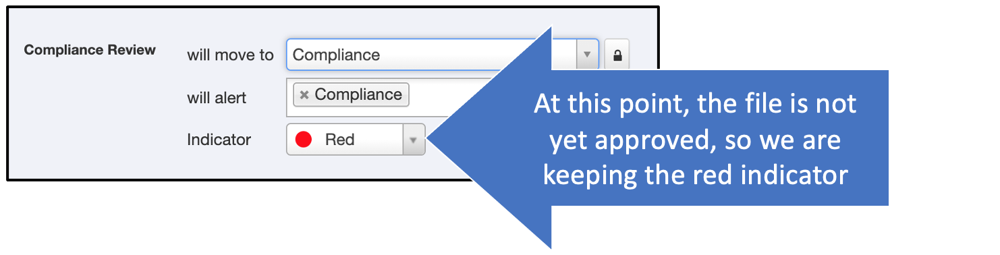

# Admin: Workflows

## Why use workflows? 

Use workflows to pass files from - for example - creator to compliance to presenter. The admin is in charge of defining the flows needed by the organization. 

Note: See [Using Workflows](presentations-workflows.md) to learn how users will interact with the completed workflows. 

## Steps

### Planning your workflow

First, define your workflow. 

* Who needs to take steps with this file? 
	* Creator
	* Approver
	* Compliance
	* Designer
	* Sales/Marketing
* What do they need to do? 
	* Create
	* Edit
	* Approve
	* Distribute or present
* Where should the file go when they have finished their task and it's ready for the next stage? 
	
Plan ahead for any type of flow. For example, perhaps there are three steps to your workflow: create, approve, present. 

But maybe there are more steps. Maybe a file will go through several rounds of editing between colleagues, then to compliance, then back for more editing, then to design, then back for more editing and to compliance again before it is approved for distribution.

>**Pro Tip!**
> 
>The more complex the workflow, the more planning it needs to understand and predict all the different paths the file might take through the flow. 

### Creating your workflow in Shufflrr

Click the "Admin" icon and go to the "Tags" tab. Click "Add Tag."

Select "Workflow" as the tag type and enter the names of the workflow stages in the open box. Enter each name on a separate line. 

For each entry, more fields will appear below so you can fill them in. For each one, you will need to choose
1. What happens when that stage is assigned - where does the file move to? 
2. What individuals or groups are notified when the file moves to this stage? 
3. Is a color assigned? The colors show up in the file list at left (see below)

#### Sample simple workflow

In this sample workflow, there are three stages: 
1. Draft
2. Compliance Review
3. Approved

The draft stage is created like this: 

Notice that it says the file goes to the "originating folder" at this stage. 

What this means is, if it moves to other folders in different stages, when someone puts it BACK in "Draft" stage, *it will RETURN to whichever folder it started in*.  

Notice the red color assigned. That looks like this in the file list: 

The second stage is "Compliance Review." For this stage, we want the file to automatically move to the "Compliance" folder and alert the Compliance team that there is a file ready for their review. 

First we select the Compliance folder: 

Then we add that the Compliance team should be notified, and keep the Red indicator because the file is not yet approved: 

>**Pro Tip!**
> 
> To set up groups to be notified, see the [Groups Page](admin-groups.md).

For the final stage, the Compliance team will set the workflow tag to "Approved" (more on how they will do this can be found in [Using Workflows](presentations-workflows.md)).

At that time the presentation will move to the Marketing folder and will get a green "Approved" indicator in the file list.

>**Pro Tip!**
> 
>To prevent further modification of approved files, set the folder permissions to "View Only." See also [Granting Permissions](presentations-permissions.md#b-give-groups-permissions).

 