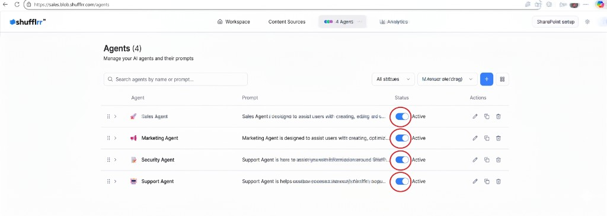

# Agent Selection

Agent selection controls which agents are active in the current experience.

Only active agents participate in workspace results.

**Steps**

1. Open **Agents** in the top navigation.
2. Use the **Active** toggle on each agent row to turn agents on or off.
3. Keep at least one agent active.
4. Return to the workspace to review updated results.

On workspace pages, more agents can be active at once than on the analytics page.
