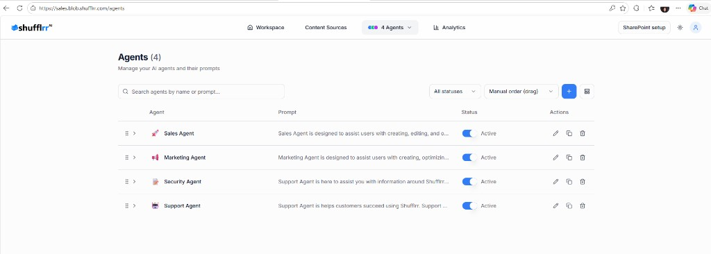

# Agents

Agents are the AI workers that search connected content and return slides for a prompt.

They are like colleagues in your company with different expertise — for example marketing, sales, finance, product development, human resources, and so on. Each agent can be configured with its own role, instructions, tone, and knowledge sources.

## Agent management

The Agents page lists all available agents and their status, including whether they are active.

You can review:

* Agent name
* Prompt
* Status
* Actions

## Expand an agent

Expanding an agent shows the knowledge sources assigned to it.

**Steps**

1. Click the expand icon beside the agent to review the prompt.

## Create a new agent

**Steps**

1. Click **Create Agent**.

### Agent & Scope

2. Enter the agent name and short description.
3. Activate the agent  
   * Turn on the **Agent is Active** option.
4. Tell the agent where to search  
   * Select the sites or sources you want the agent to reference.
5. Input file types to prioritize.

### How it Responds

Complete the **How it Responds** section in the Create Agent flow to define how the agent answers prompts.

### Skills

Complete the **Skills** section to add or adjust skills for the agent.

## Delete an agent

**Steps**

1. Click the trash icon beside the agent.
2. Confirm deletion.
