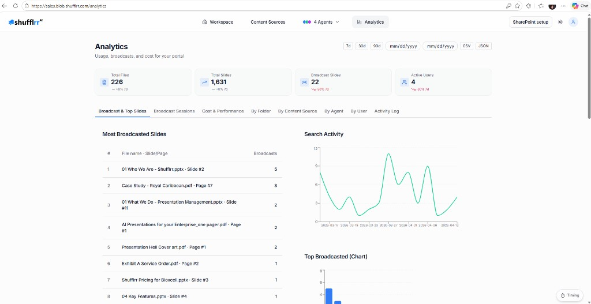

# Analytics

The Analytics page gives visibility into content usage, broadcasts, agents, sources, and users.

## Summary cards

At the top of the page, key metrics are displayed as summary cards.

Common examples include:

* Total Files
* Total Slides
* Broadcast
* Active Users

## Analytics tabs

The page includes several tabbed views.

### Broadcast Session

The Broadcast Session tab shows which slides are used most often.

### Costs & Performance

The Costs & Performance tab summarizes cost and performance metrics.

### By Folder

The By Folder tab shows how files are distributed across folders.

### By Content Source

The By Content Source tab shows how content is distributed by source type.

### By Agents

The By Agents tab compares agent output and broadcasts.

### By User

The By User tab lists user activity and contribution details.

## Activity Log

Use the **Activity Log** for a detailed record of activity alongside the summary views above.

> **Tip:** The analytics page limits the number of active agents in the selector.
