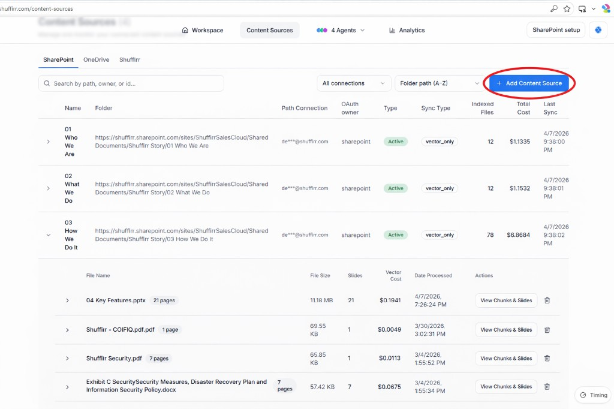

# Content Sources

Content Sources is where administrators manage the files and repositories that feed Shufflrr Blob.

Examples of source types include:

* SharePoint
* Google Drive
* Local folders
* Shufflrr

## Why use Content Sources?

Content Sources define where the AI agents look for presentation content. A well-organized set of sources improves search quality and keeps results relevant.

## View connected sources

The Content Sources page shows a table of existing sources and their metadata.

You can review:

* Source name
* Folder name
* Path or connection
* Source type
* Sync type
* Indexed file count

## Expand a source

Expanding a source shows the files connected to that source.

**Steps**

1. Click the expand icon on a source row.
2. Review the list of processed files.
3. Check file size, slide count, and processed date.

## Add a content source

**Steps**

1. Choose a source type: **SharePoint**, **OneDrive**, or **Shufflrr**.
2. Click **Add Content Source**.
3. Browse to the source.
4. Use the drop-down to connect.
5. Define **batch size** — the number of files indexed initially by the Blob.
6. Click **Start Indexing**.

## Delete a content source

**Steps**

1. Click the trash icon on the source row.
2. Confirm deletion.
