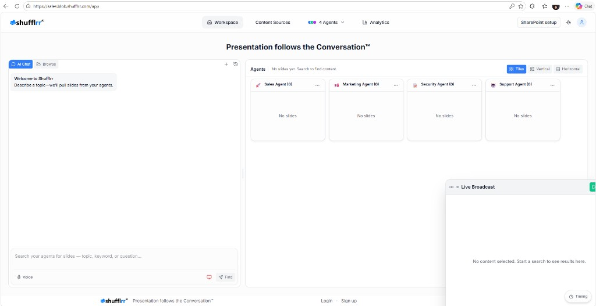

# Getting Started

Getting started in Shufflrr Blob is a four-step process:

1. Open the workspace
2. Activate agents
3. Enter a prompt
4. Review and use results

## 1. Open the workspace

Log in to your Shufflrr AI Presentation Blob. The URL is `https://yourblobname.shufflrr.com` (use your organization’s blob host name in place of `yourblobname`).

## 2. Activate agents

Use the agent selector in the top navigation to choose which agents should participate. Active agents are the ones that return slides in response to your prompt.

## 3. Enter a prompt

Type a presentation request into the prompt box, such as:

* Prepare a Q3 board review deck with financial highlights
* Build a new hire onboarding presentation
* Find sales slides for healthcare prospects

Press Enter or click **Generate** to submit the request.

## 4. Review and use results

Each active agent returns slide results related to the selected prompt. Review the thumbnails, switch views if needed, and send the best slide to broadcast when appropriate.

> **Tip:** More specific prompts usually produce better results.
