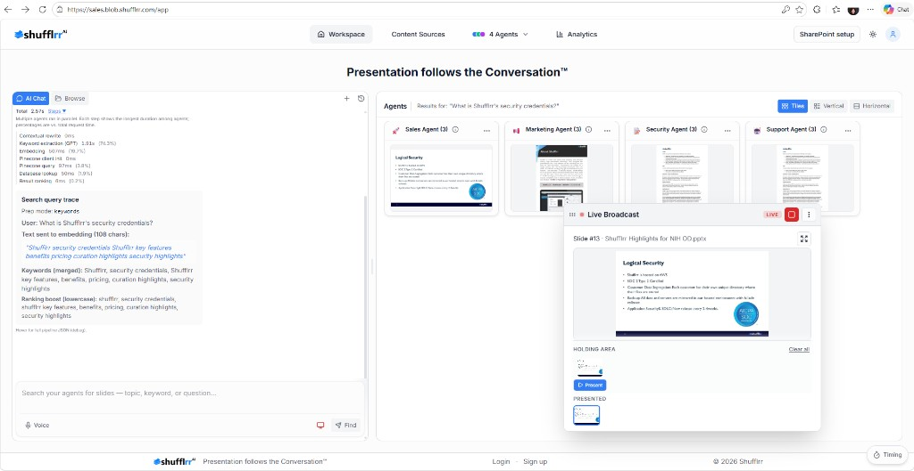

# Live Broadcast

The live broadcast window displays the currently selected broadcast slide in a floating panel.

It appears automatically after a user sends a slide to broadcast.

## Use the broadcast window

**Steps**

1. Send a slide to broadcast from the workspace.
2. Review the floating broadcast panel.
3. Drag the panel to reposition it.
4. Use the size controls to expand or shrink it.
5. Use the close or minimize control when needed.

## Broadcast history

A history strip appears in the panel and displays previously broadcast slides.

Users can scroll through the history and identify the current slide.
