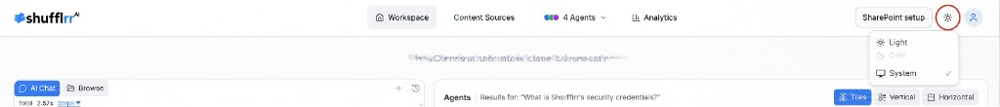

# Theme Switching

Shufflrr Blob supports light, dark, and system (follow the device) themes.

**Steps**

1. Click the theme icon in the top navigation.
2. Choose **Light**, **Dark**, or **System**.
3. Continue working with the updated appearance.

The selected theme persists across page navigation.
