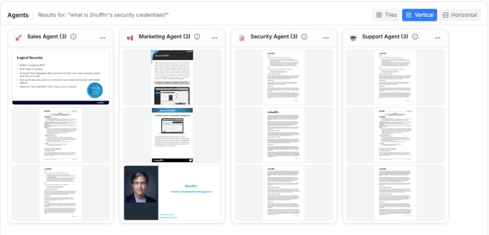

# Workspace — Getting Slides to Present

The workspace is the main area where users create presentations through conversation.

It includes two primary panels:

* A prompt and thread panel on the left
* An agent results panel on the right

## Prompt input

Use the prompt box to describe the presentation you need.

**Steps**

1. Click into the prompt area.
2. Type your presentation request.
3. Press Enter or click **Generate**.
4. Use **Shift + Enter** for a multi-line prompt.
5. Use the microphone button to toggle voice input when needed.

After submission, your prompt appears in the thread and an agent response appears below it.

## Thread history

Thread history helps users manage multiple conversations.

**Steps**

1. Click the history icon in the prompt panel.
2. Review existing conversation threads.
3. Click a thread to reopen it.
4. Click **+** to start a new thread.
5. Close the history panel when finished.

The first prompt in a new thread becomes the thread title.

## Agent feed

The agent feed displays slide results from each active agent.

### Row mode

In row mode, agents are stacked vertically and each one displays a horizontal row of slide thumbnails.

**Steps**

1. Scroll to the agent you want to review.
2. Use the left and right arrows to move through the slide strip.
3. Hover over a thumbnail to reveal slide actions.

### Tile mode

Tile mode changes the layout to a larger, more visual grid.

**Steps**

1. Click the layout toggle in the agent panel.
2. Review the larger slide previews.
3. Use previous and next controls to browse each agent's slides.

## Use Results in a Broadcast

Slides returned by agents can be played in Shufflrr and shared through the broadcast app of your choice.

**Steps**

1. Open the slide or file you want to present.
2. Click **Play** to show it in Shufflrr.
3. Connect to Zoom, Microsoft Teams, WebEx, or another broadcast app.
4. Use **Share Screen** in that app.
5. Show the Shufflrr slide or file in Play or full-screen mode.
