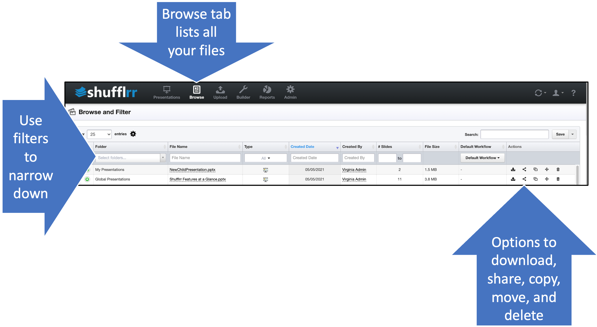

# Browse

The browse tab provides a flat list of all files in all folders you have permission to see. 

<iframe width="560" height="315" src="https://www.youtube-nocookie.com/embed/e9HEJgnMXqs" title="YouTube video player" frameborder="0" allow="accelerometer; autoplay; clipboard-write; encrypted-media; gyroscope; picture-in-picture" allowfullscreen></iframe>

* Use the filters at the tops of columns to narrow down what files to see. 
* Use the options at right to take action on files. 
* Use the gear icon to select what columns to display. 

