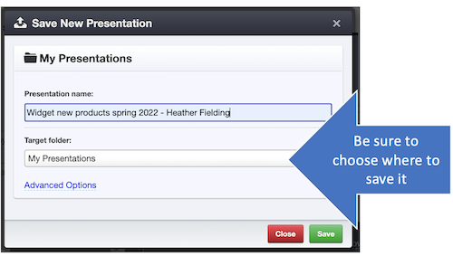

# Builder

<iframe width="560" height="315" src="https://www.youtube-nocookie.com/embed/4NS9FzJNSug" title="YouTube video player" frameborder="0" allow="accelerometer; autoplay; clipboard-write; encrypted-media; gyroscope; picture-in-picture" allowfullscreen></iframe>

## Why use builders? 

Builders are used to quickly start multiple child presentations with a few key details different, such as different sales rep names.

Builders must be set up by administrators. 

## Steps

To use a builder, click "Builder" in the top navigation and select the builder you wish to utilize. Enter the customizable text in the fields provided. 

Include any / all additional slides you want to add & click Save. 

>**Pro tip!**
> 
> You'll notice that you do not have the option to pick and choose; slides are in groups that come together. This is by design. You can always edit later--_if_ you are sure that's in line with marketing intentions. 

Be sure to choose where to save. You probably don't want to save in the builder folder. 

The presentation may take a few minutes to save (please see [File Processing](presentations-uploading.md#file-processing) for details about the process). Once processing is complete, you'll see the presentation with the text customized. 

