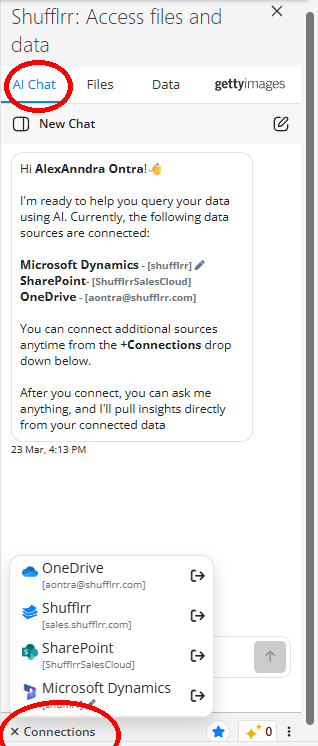

# Shufflrr AI in the Add-in

## Does the Shufflrr Add-in have AI?

Yes. The Shufflrr Add-in includes **AI search**. You can connect **OneDrive**, **Shufflrr**, **SharePoint**, and **Dynamics** as searchable sources.

## How Shufflrr AI works

Shufflrr AI looks in your connected business sources and returns approved files that answer your prompt. It does not generate made-up answers. Instead, it surfaces compliant, on-brand presentation content prepared by your organization.

## Steps

1. Open the **AI Chat** tab (first tab in the Shufflrr Add-in task pane).
2. Confirm your sources are connected from **Connections** / **+ Connections** (bottom-left of the pane). You can connect **OneDrive**, **Shufflrr**, **SharePoint**, and **Microsoft Dynamics**.

3. Ask a specific question and, when possible, specify where to search.
4. Review the files Shufflrr AI returns.
5. Click a result file to open the preview below, then scan thumbnails and insert the needed slide or image.

> **Tip:** More specific prompts usually produce better results.

