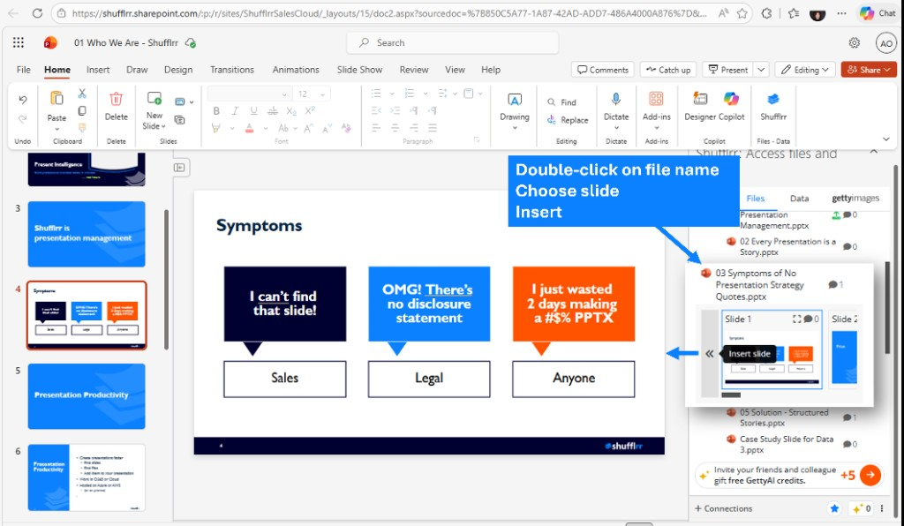

# Insert slides and images with the Shufflrr Add-in

You can find slides and images from your Shufflrr library and insert them into your PowerPoint presentation without leaving the Add-in. Use AI search or browse by folder and keyword.

## How to find a slide

**Option 1 — Shufflrr AI**

1. In the Add-in, select the first tab, **AI** (Shufflrr AI / AI Chat).
2. Describe the slide or content you need (e.g., "pricing table," "team org chart").
3. Shufflrr returns files with slides and content matching your description.
4. Click a file to open a preview, scroll through the slides, pick one, and insert it into your presentation.

**Option 2 — Browse and search**

1. Open the **Files** tab in the task pane.
2. Browse the **folders and files** in your library (OneDrive, Shufflrr, SharePoint).
3. Use **keyword search** for files stored in Shufflrr Cloud to narrow results.

## How to add a slide to your presentation

On the **Files** tab, use this flow:

1. **Double-click** the file name to open a slide preview.
2. **Choose** the slide you want from the thumbnails below the file name (scroll left to right if needed).
3. Click **Insert slide** (or **Insert** / **>>**) to add that slide into your open presentation.

## How to add an image to your presentation

Images are handled the same way as slides:

1. **Double-click** the file — thumbnails open below.
2. **Scroll** and select the image (or slide containing the image). A **blue border** indicates the selection.
3. (Optional) Click the **expand icon** on the thumbnail for a larger preview.
4. Click **Insert** (or **Insert slide** / **>>**) to insert it into your presentation.

## Video in the Add-in

Microsoft Office does not currently support video inside Add-ins. When Microsoft adds support, Shufflrr will make this feature available in the Add-in.

## Quick tips

- Use the **built-in AI search** to find slides, decks, and related SharePoint files quickly.
- **Office 365 auto-saves** your changes as you work.
- Keep **file names identical** when updating files so version tracking and auto-updates work correctly.
