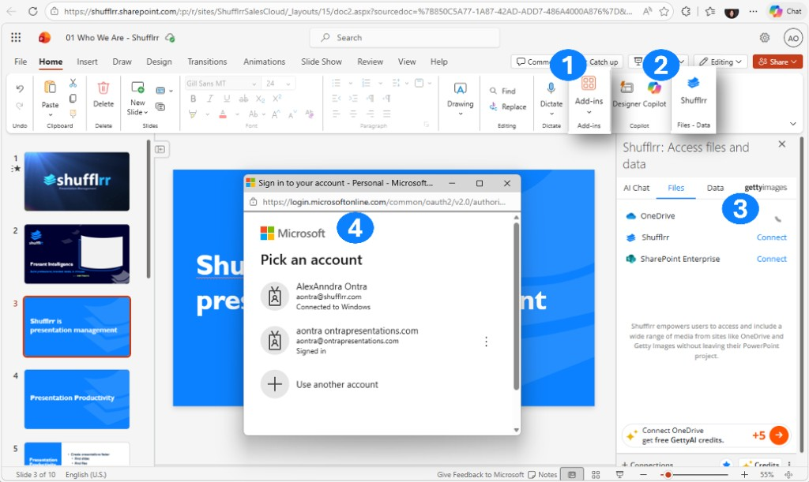

# Sign in to the Shufflrr Add-in

The Shufflrr Add-in gives you direct access to your company's Shufflrr presentation library inside PowerPoint. You can search, drag, and insert branded slides, edit presentations, and upload updates — all without leaving PowerPoint.

This add-in works with **Office 365 PowerPoint** (web). You sign in once to connect **OneDrive**, **Shufflrr**, and **SharePoint** in the task pane.

## Steps

1. In PowerPoint (web), open **Add-ins** on the **Home** ribbon, or use the **Shufflrr** button in the ribbon (under **Files – Data** next to Designer / Copilot) to open the task pane.
2. In the Shufflrr pane (**Shufflrr: Access files and data**), open the **Files** tab. You’ll see **OneDrive**, **Shufflrr**, and **SharePoint** — use **Connect** where needed.
3. When prompted, complete **Microsoft sign-in** (pick your account or use another account).
4. After you’re signed in, your connected sources appear in the task pane so you can browse files.

## Troubleshooting sign-in

| Issue | Cause | Fix |
|-------|--------|-----|
| "Not Connected" error | Missing callback URL in Azure | Add the correct Redirect URI under Web + SPA in your app registration. |
| Login fails | Wrong client secret value | Update with the actual secret in the Shufflrr admin portal. |
| Add-in doesn't load | Using desktop PowerPoint | Use the **Office 365 web version** of PowerPoint; the add-in is built for that. |

> **Tip:** Allow browser pop-ups from Shufflrr and Microsoft so sign-in windows can open.
