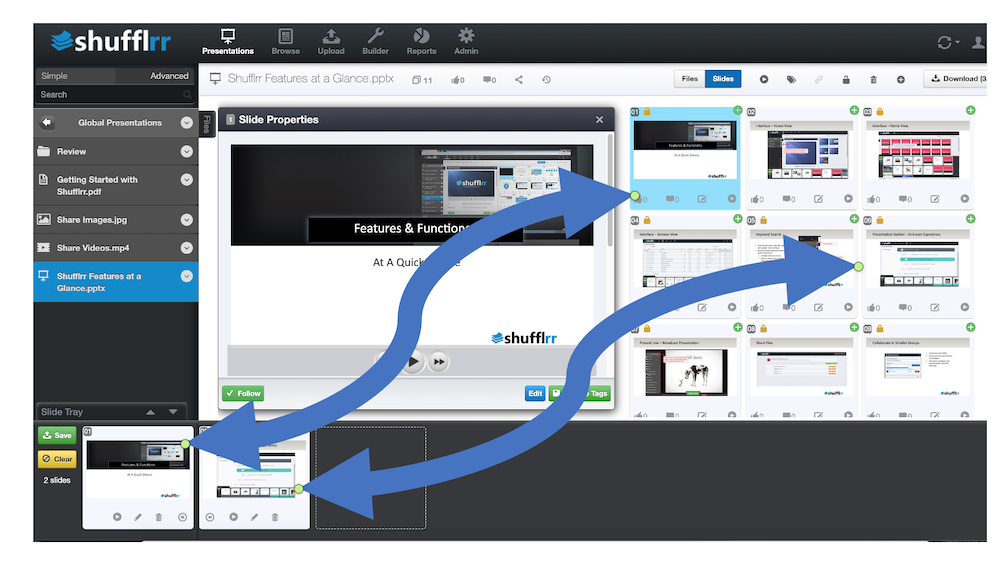
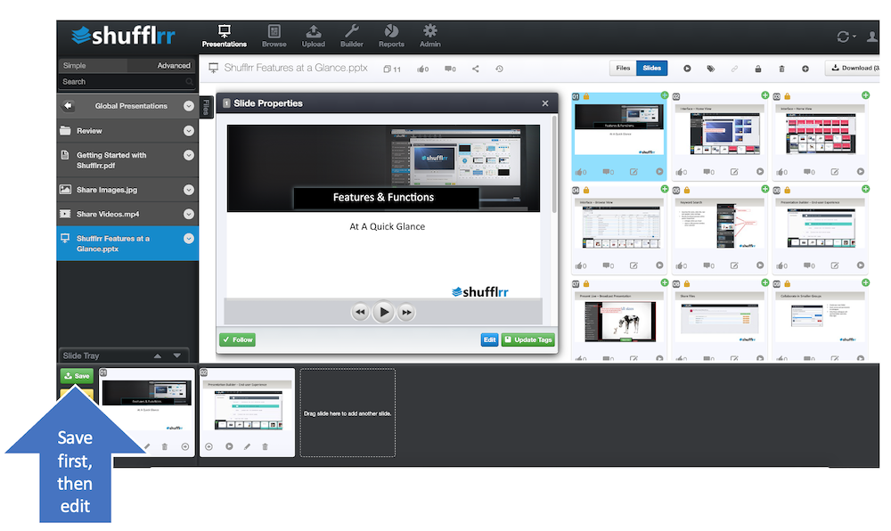
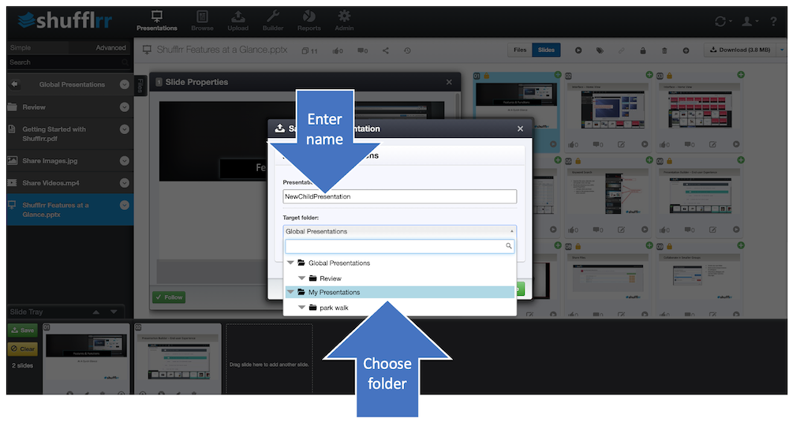
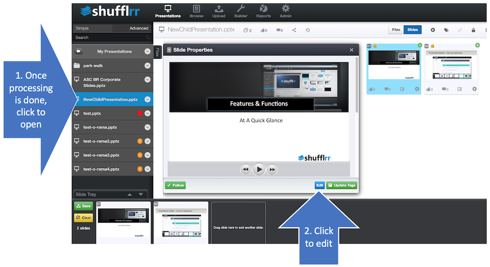

# Building new presentations

<iframe width="560" height="315" src="https://www.youtube-nocookie.com/embed/mfMjJ4X_H7U" title="YouTube video player" frameborder="0" allow="accelerometer; autoplay; clipboard-write; encrypted-media; gyroscope; picture-in-picture" allowfullscreen></iframe>

## Why build a new ("child") presentation from existing ("parent") presentations?

* Updating "parent" presentations updates the "children," meaning that all "child" presentations stay consistent in 		
	* branding
	* messaging
	* accuracy
	* oversight
	* confidentiality
	* compliance 
* Use existing material to make new decks without duplication of effort. 

> **Pro tip!** 
>
> Parent-child updates and saving time with existing material are two key features of Presentation Management! 

## Steps

Use the slide tray, also called the Slide Cart, to collect the slides for your new presentation. The slide tray is at the bottom of the app.

There are three main places where you can find, preview, and add slides to the slide tray.

### Presentation view

Presentation view is the default view, with folders on the left.

1. Click a folder to open it.
2. Click a file, such as a PowerPoint, image, video, PDF, or Word file.
3. Review the slide thumbnails on the right.
4. Drag a slide into the slide tray, or click the green plus icon in the upper right of the slide thumbnail.

### Browse view

Browse view lists files in chronological order, with the most recent files near the top.

1. Click **Browse** from the menu at the top of the app.
2. Use the filters on the left to narrow the list by folder or other criteria.
3. Use keyword search to find file names and file tags.
4. Click the plus to the left of a file name to preview the thumbnails below it.
5. Open multiple files if needed and scroll through the page.
6. Drag a slide into the slide tray, or click the plus icon in the upper right of the slide thumbnail.

### Search

Search is located above the folders, under the logo at the top left of the app.

1. Enter your search terms.
2. Press **Enter** or click the magnifying glass.
3. Refine results by partial match, exact match, file type, folder, or tag when needed.
4. Review the results on the right.
5. Click the green plus icon in the upper right of a slide thumbnail to add it to the slide tray.

Once you see the slide you want, there are two ways to pull it into your new deck. 
* Drag it into the slide tray at the bottom of the screen. 
* Click the green circle with a plus sign at the top right.

Now, you can open another presentation and drag more slides to your tray. Keep going until you have all the slides you need. 

When you have the slides you need in your tray, **save the presentation** before going further. 

When you save, name the file and choose the folder where it should be saved.

> **Q & A**
>
> Q. What happens when you put slides in your slide tray, then leave them there, instead of saving right away? 
>
> A. When eventually you go to save, **the parent may have been updated** - meaning it no longer exists in the same form as when you dragged it to your tray. In this case the **system will not let you save.** 

* When you save, processing can take a few minutes (see [processing](presentations-uploading.md#uploadProcessing) for details)
* **Until processing is done, you won't see the presentation in the left navigation.** 
* This save creates a new deck of "child" slides in the folder you selected.
* Now you can edit them, reorder them, whatever you need to do. 

You can edit your slides right in Shufflrr! 

Visit the [Editing Presentations](presentations-editing.md) page to learn more. 

> **Pro tip!**
> 
> If you download the deck to make changes in another application, be sure to upload it with the *same name*. Otherwise, you will break the [parent-child relationship](presentations-slide-inheritance.md), and updates will not come through to the children. 

    
    
    
