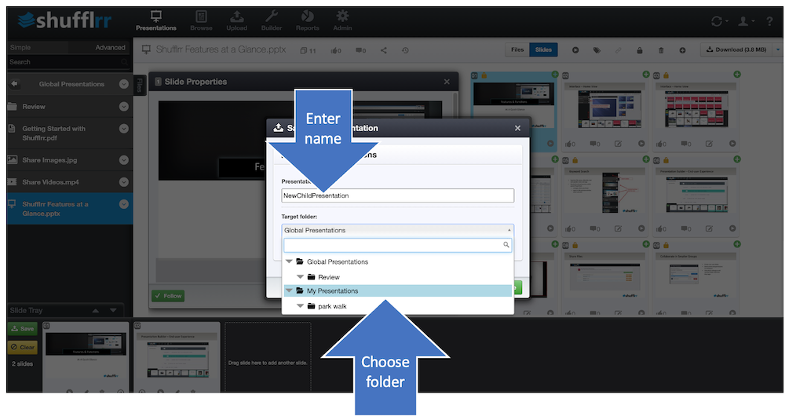
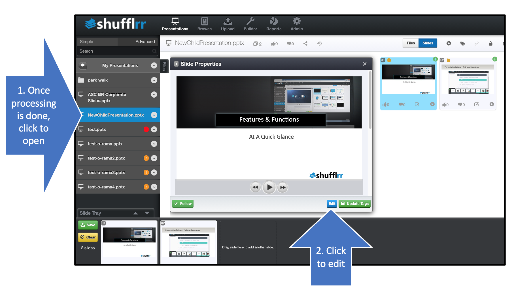

# Build new presentation

## Why build a new ("child") presentation from old ("parent") presentations?

* Maintain "child" presentations' branding, messaging, accuracy, oversight, confidentiality, and compliance. 
* Use existing material to make new decks without duplication of effort. 

## Steps
There are two ways to see existing slides that you might want to use in a new presentation. 
* Use visual search to get exactly the content you need ([Search instructions here](shufflrr-search.md)). 
* Or, open any presentation in the main area of the page. 

Once you see the slide you want, there are two ways to pull it into your new deck. 
* Drag it into the slide tray at the bottom of the screen. 
* Click the green circle with a plus sign at the top right.

Now, you can open another presentation and drag more slides to your tray. Keep going until you have all the slides you need. 

When you have the slides you need in your tray, **save the presentation** before going further. 

> #### Q & A
> Q. What happens when you put slides in your slide tray, then leave them there, instead of saving right away? 
>
> A. When eventually you go to save, **the parent may have been updated** - meaning it no longer exists in the same form as when you dragged it to your tray. In this case the **system will not let you save.** 

* When you save, processing can take a few minutes (see [processing](presentations-upload.md#uploadProcessing) for details)
* **Until processing is done, you won't see the presentation in the left navigation.** 
* This save creates a new deck of "child" slides in your personal folder. 
* Now you can edit them, reorder them, whatever you need to do. 

You can edit your slides right in Shufflrr! 

> #### Pro tip! 
> Don't download the deck to make changes in another application. This will break the [parent-child relationship](presentations-slide-inheritance.md), and updates will not come through to the child. 

    
    
    