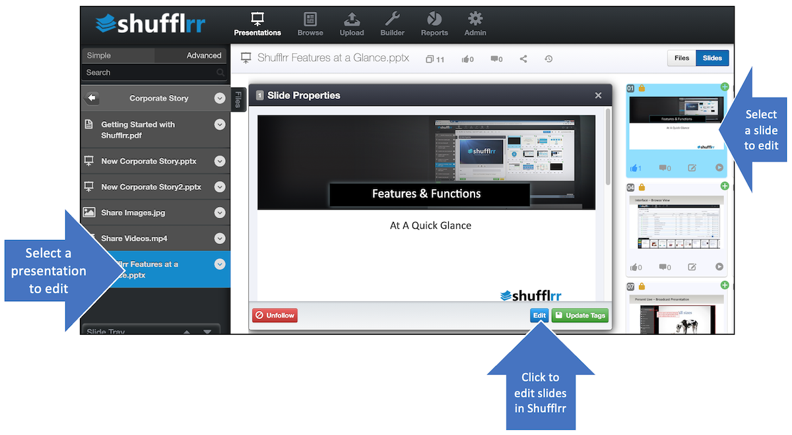
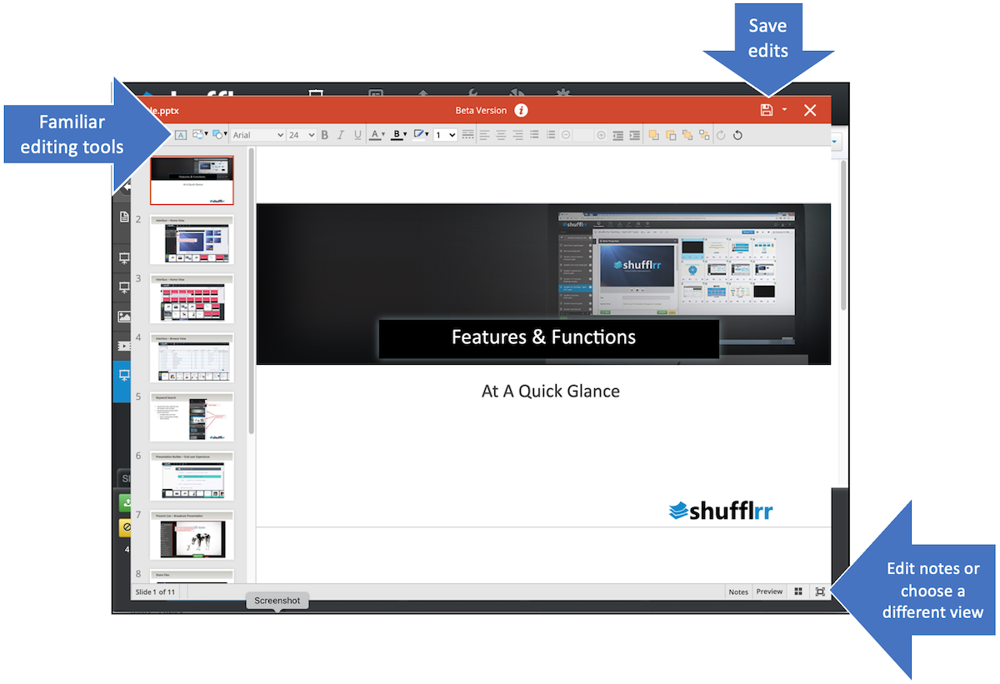
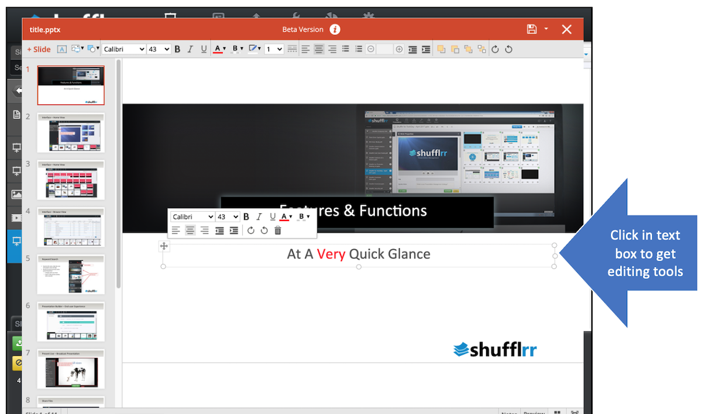
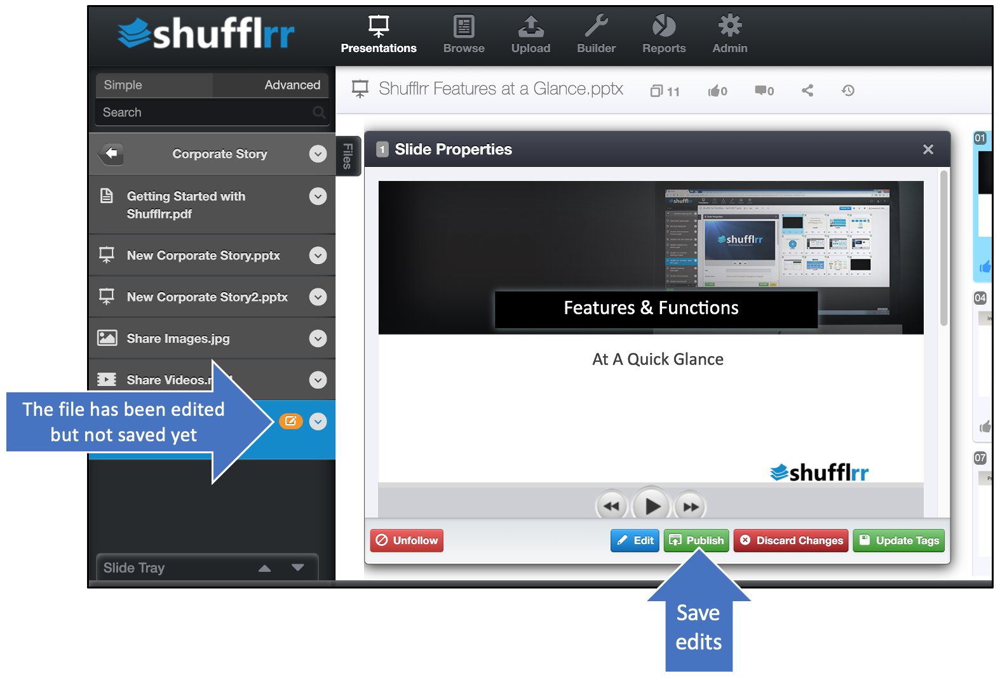
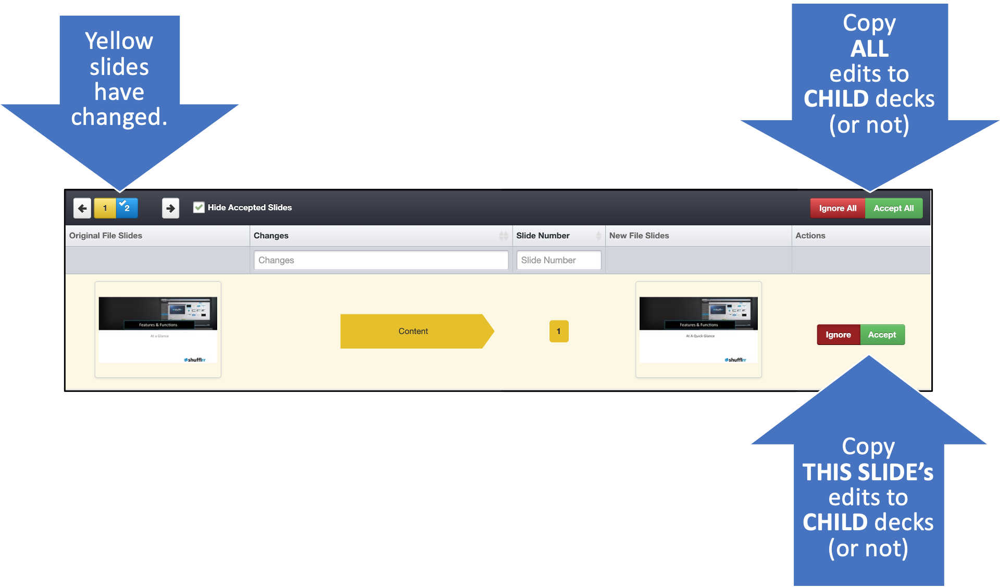

# Editing

## Why Edit a presentation? 

Editing isn't necessary for some use cases in a Presentation Management System. 

Sometimes, people just want the parent slides created by the SMEs, arranged into child decks that suit specific purposes. 

Other times, aspects of a child deck need to be edited. Perhaps an agenda or title needs to be added or updated, or additional content added for a special case. In these cases, editing is needed. 

## Steps

For minor tweaks, a deck can be edited right in Shufflrr. 
* Open the presentation by clicking on it in the left navigation. 
* Select the slide to be edited and click the edit button.

On clicking the edit button, the Shufflrr editor opens. 
* Familiar tools for adding a text box, picture, or shape are included at top left.
* Text options are across the top

 

* Click in the text box to edit text. 
* Click an image to move or resize.

When you close the editing screen, you will have the option to discard or publish (save) changes. 

Once the publish button is clicked, the steps of file processing will be carried through. See [File Processing](presentations-uploading.md#uploadProcessing) for more details. Note that while the file is processing, the old slides will still be visible; your changes have not been lost. 

### Last step! 

If this is a ***Parent*** presentation (in other words, if other decks have been made with slides from this presentation), you will need to specify whether you want these changes to be made in ***Child*** presentations. 

For more information please see [Parent-Child Relationships](presentations-slide-inheritance.md) and/or [Parent-Child Updating](presentations-version-control.md).