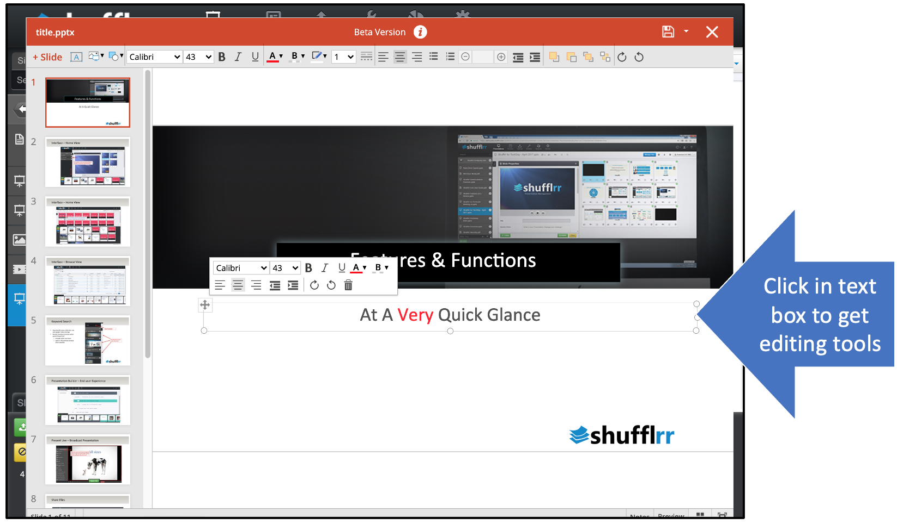

# Editing

<iframe width="560" height="315" src="https://www.youtube-nocookie.com/embed/m6E9H8q3W1I" title="YouTube video player" frameborder="0" allow="accelerometer; autoplay; clipboard-write; encrypted-media; gyroscope; picture-in-picture" allowfullscreen></iframe>

## Why Edit a presentation in Shufflrr's interface? 

Editing is only necessary for certain use cases in a Presentation Management System. 

Sometimes, people just want to use slides created by the SMEs, to be arranged into "child" decks that suit specific purposes. In that case no editing needed. 

Other times, people want to very heavily change a presentation or add animations and charts; in that case, downloading the deck to edit in PowerPoint or Slides might be a better option. Just be sure to save it back into Shufflrr *with the same name*, otherwise parent-child relationships will break. 

*The time to use editing in Shufflrr* is: 
* When you need to customize. For example: 
	* an image of the city where you are presenting
	* the date or presenter name on the title slide
* When you need to make a quick fix (a typo or other mistake)

>**Pro Tip!**
> 
>If you download a deck to edit in PowerPoint, ***UPLOAD IT WITH THE SAME NAME.*** This avoids breaking the parent-child relationship. 

## Steps

For minor tweaks, a deck can be edited right in Shufflrr. 
* Open the presentation by clicking on it in the left navigation. 
* Select the slide to be edited and click the edit button.

On clicking the edit button, the Shufflrr editor opens. 
* Familiar tools for adding a text box, picture, or shape are included at top left.
* Text options are across the top

 

* Click in the text box to edit text. 
* Click an image to move or resize.

When you close the editing screen, you will have the option to discard or publish (save) changes. 

Once the publish button is clicked, the steps of file processing will be carried through. See [File Processing](presentations-uploading.md#uploadProcessing) for more details. Note that while the file is processing, the old slides will still be visible; your changes have not been lost. 

### Last step! 

If this is a ***Parent*** presentation (in other words, if other decks have been made with slides from this presentation), you will need to specify whether you want these changes to be made in ***Child*** presentations. 

For more information please see [Parent-Child Relationships](presentations-slide-inheritance.md) and/or [Parent-Child Updating](presentations-version-control.md).
