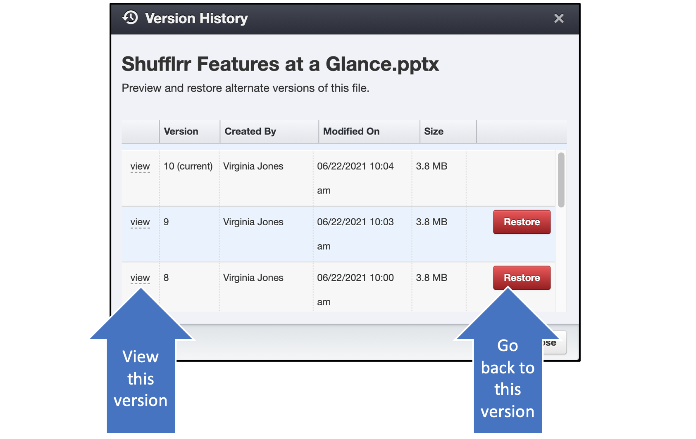
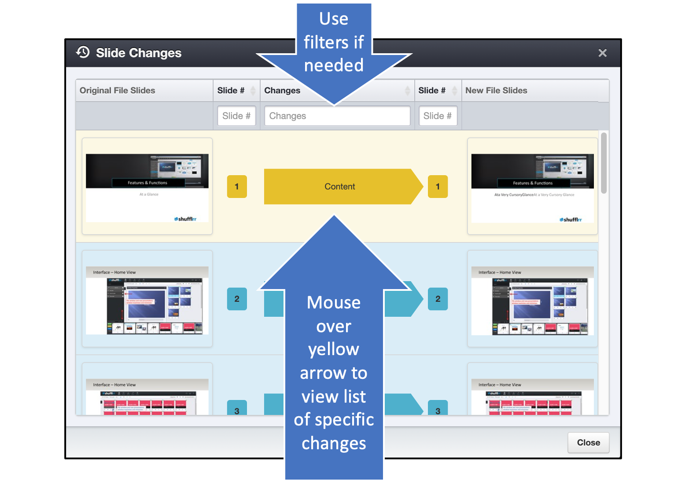

# File History

## Why use file history? 

Part of Shufflrr's Presentation Management System is the ability to return to an earlier version of a file, even after changes have been made. This allows for the remediation of mistakes, or, the resurrection of an alternate version of a presentation. 

<iframe width="560" height="315" src="https://www.youtube-nocookie.com/embed/qkJ9CfE4HJ0" title="YouTube video player" frameborder="0" allow="accelerometer; autoplay; clipboard-write; encrypted-media; gyroscope; picture-in-picture" allowfullscreen></iframe>

## Steps

Click the clock reversal icon above the presentation window. 

The popup gives a list of past versions with the option to view or return to them. Scroll to see all versions. 

If "View" is clicked, the presentation's previous version and the clicked-on version will be displayed in a new popup, slide by slide, with all changes indicated. Mousing over a yellow arrow will give a more specific list of changes. 

