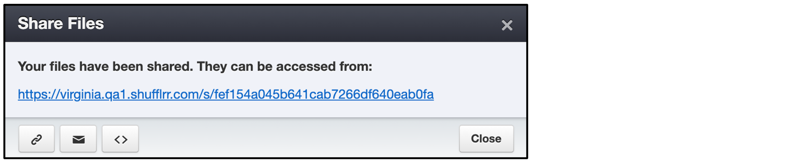

# File Sharing

<iframe width="560" height="315" src="https://www.youtube-nocookie.com/embed/996mJm9m9KQ" title="YouTube video player" frameborder="0" allow="accelerometer; autoplay; clipboard-write; encrypted-media; gyroscope; picture-in-picture" allowfullscreen></iframe>

## Why share a file? 
* Provide information to clients 
* Provide information to sales prospects
* Ask a colleague for their opinion

> **Pro tip:**
>
> If you want to submit the file for approval, use [workflow tags](admin-workflow.md), not shares! 

## Steps

There are many ways to share a deck. For one, click the down arrow next to the file name in the left navigation to see a share option.

Use the dropdown and "ADD" button if you want to share multiple files at once.  

* Enter the email addresses you want to share with & add a message. 
* Select whether to allow downloads (and in what format)
* Select whether to get alerts 
* Set an expiry if needed

The success popup will have a link you can click to see the share, or use icons at lower left to capture it in different formats.

 

You can see whether your past shares were opened or downloaded as well as take action on past shares - see the [user profile shares tab](admin-users.md#share-reporting) information. 

