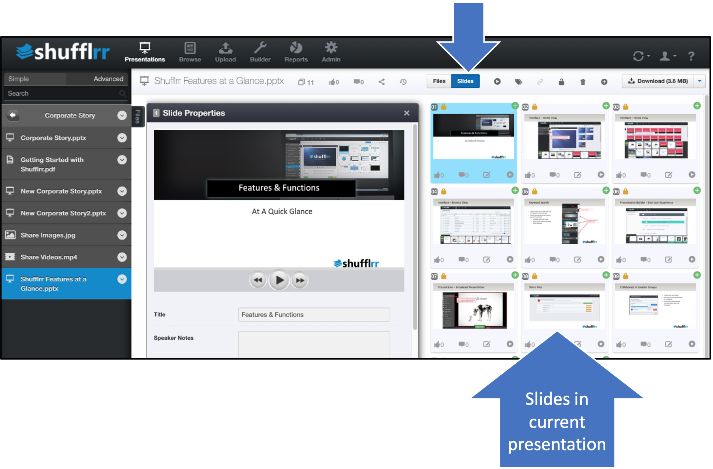
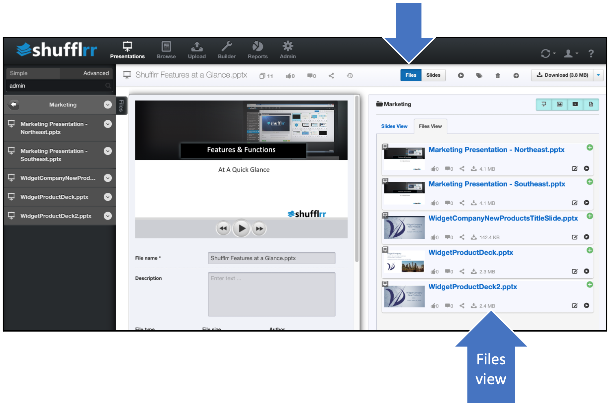
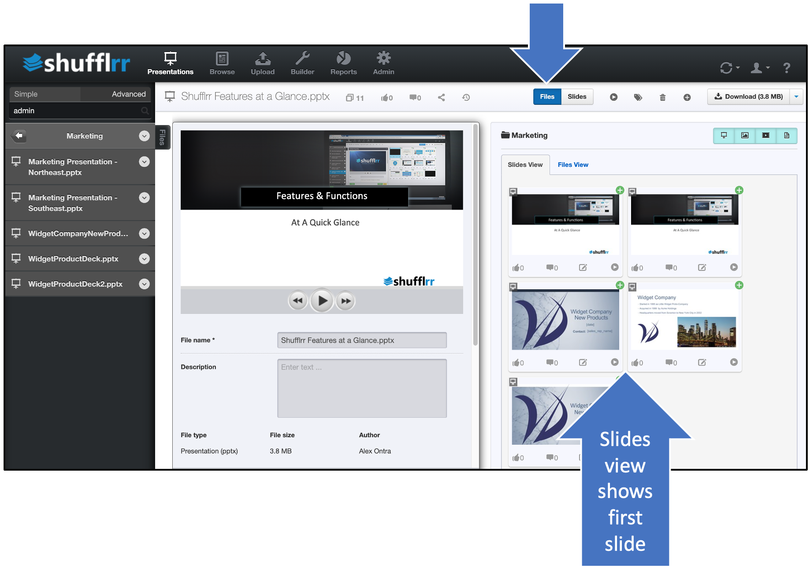

# Files-Slides Toggle

## Why use the Files-Slides Toggle? 

This toggle allows you to either see the slides in the current presentation or the contents of the folder (as thumbnails or list). It aids in Presentation Management by allowing you to smoothly gather slides from different presentations into the slide tray.

## Steps

By default the toggle is set to "Slides" and the slides in the current presentation are displayed. From here, slides can be dragged into the [Slide Tray](shufflrr-slide-tray.md) or added with the green plus sign. 

When you want to see all the files in the current folder, you can simply slide the toggle to "Files." This allows you to select a desired presentation to be the current presentation, and pull slides from this presentation into the Slide Tray.

Under "Files," there are also two possible views. One is "Files," which shows a list of files. 

The other view under "Files" is "Slides," which shows the first slide of each presentation. 

