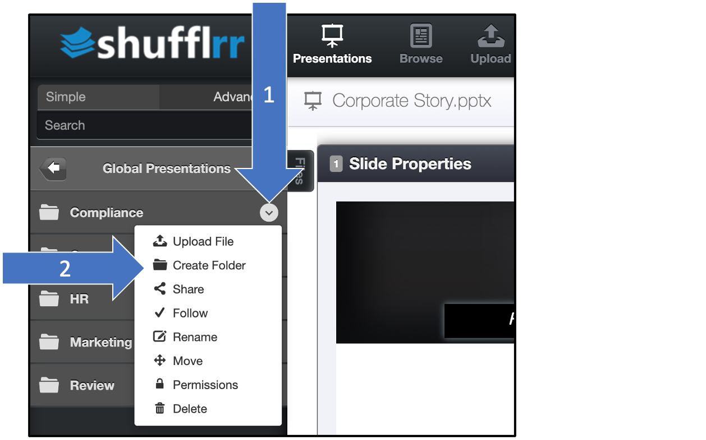

# Creating folders

## Why create folders? 

* Organize all the content for your organization
* Give different people permission to see different files

>  **Pro tips!**
> 
> * Organize the folders for the content _before_ uploading.
> * Organize folders to match your corporate structure.
> * [Add permissions](presentations-permissions.md) to maintain confidentiality and simplify searches.  

## Steps

Click the three dots next to the folder name. "Create Folder" is one of the options.  

 

Once your folders are organized, you can begin [uploading content](presentations-uploading.md).

