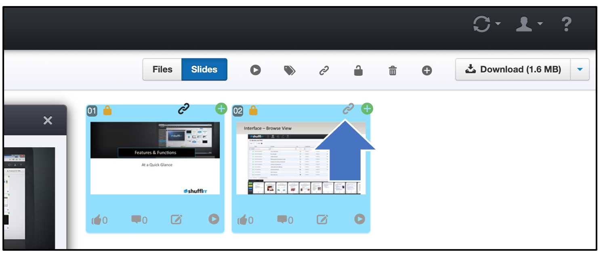

# Slide Linking

## Why use Slide Linking? 

Slide linking can be set up to ensure that two slides - for example, a slide with a product and a slide with corresponding disclaimer or other legal text - stay together, that one cannot be pulled into the slide tray without the other. 

## Steps

You will only be able to link slides if you have "write" permissions for a file (see [permissions](presentations-permissions.md)) for more information). 

To link slides, simply highlight the two or more slides you want linked, and click the little chain icon above the editing pane. The deck does not need to be saved. 

As soon as you link the slides, they will have a little chain link at the top. They will immediately be linked for all users of the deck. Note that the link will propagate to new child decks, but not previously made child decks. 

Unlink slides by selecting the slide(s) to be separated out, and clicking the "link" icon again (now it will show as a breaking link icon). 