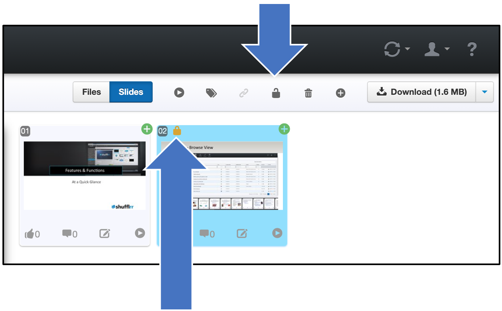

# Slide Locking

## Why use Slide Locking? 

Slide locking can be effective when an administrative or permissions-holding user wishes to allow users without editing permissions to still edit ONLY a few particular slides - for example, a title page or agenda.

To lock slides, an admin user can select the slides they want locked and click the lock icon at top right. A small lock will appear in the corner of the locked slide. 

Now, even if this slide is moved to a child deck, it will remain locked. 

