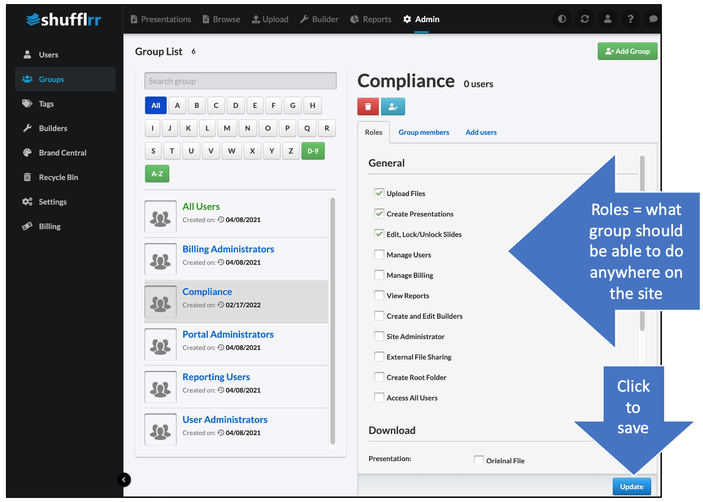

# Folder Permissions

<iframe width="560" height="315" src="https://www.youtube-nocookie.com/embed/Y9DLddTgceY" title="YouTube video player" frameborder="0" allow="accelerometer; autoplay; clipboard-write; encrypted-media; gyroscope; picture-in-picture" allowfullscreen></iframe>

## Why set permissions on folders? 
* Maintain confidentiality: Only people who should see this content can see it.
* Maintain content integrity: Those who should not edit this content won't be able to do so. 
* Simplify searching: If users only have permissions to see into a few folders, their searches won't be cluttered with hundreds (or thousands!) of files irrelevant to them.
* Presentation Management is structured storytelling. Permissions on folders create the structure to help people tell your story. 

## Steps

### Set up groups 

* Once you have saved your group, you are automatically taken to the group settings 
* Check off the roles you would like for this group overall (not in reference to a folder yet). 

#### Add people to your group 

Select the user tab, search for users, and click "Add" to add specific people to the group. 

### Give groups permissions 
Click the down-arrow on the right side of the folder name. Select "Permissions."
 
In the first box, type the name of the group who should have permissions to this folder. 

* Select View Only, Read, Write, or Full Control.
	* _View Only_: 
		* Users can ONLY VIEW & PRESENT from this folder. 
	NO copying, downloading, or editing, or using this material in new presentations. 
    * _Read_ means users can VIEW, PRESENT, and USE material in this folder in new presentations, but cannot EDIT slides in this folder. 
    * _Write_  means users can VIEW, PRESENT, USE, and EDIT material in this folder. 
    * _Full Control_ means users can take ANY ACTION on material in the folder, as well as updating permissions on the folder itself. 
    
* For Read or Write, select whether this group can SHARE presentations or not. 
	* Full Control always allows sharing
	* View Only never allows sharing
* Sharing a presentation gives the user the ability to send it to anyone internal or external in a read-only, slide-show-viewer format. 

> **Pro tip!**
> 
> You can also grant permissions to an individual
