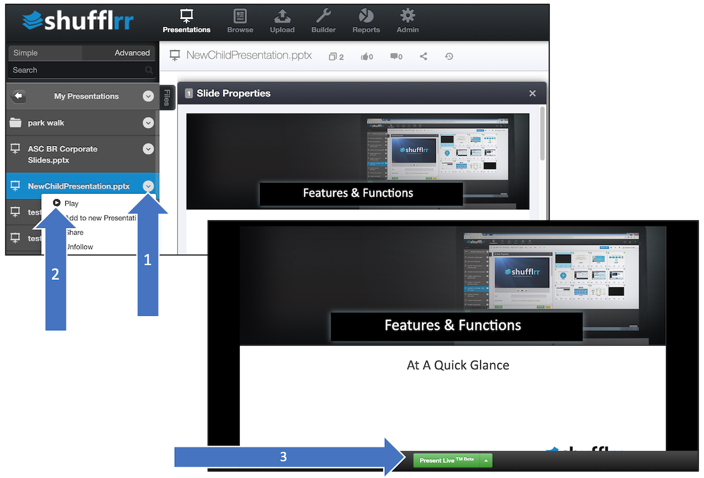
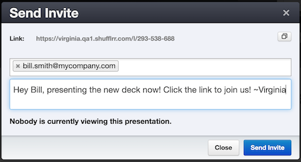
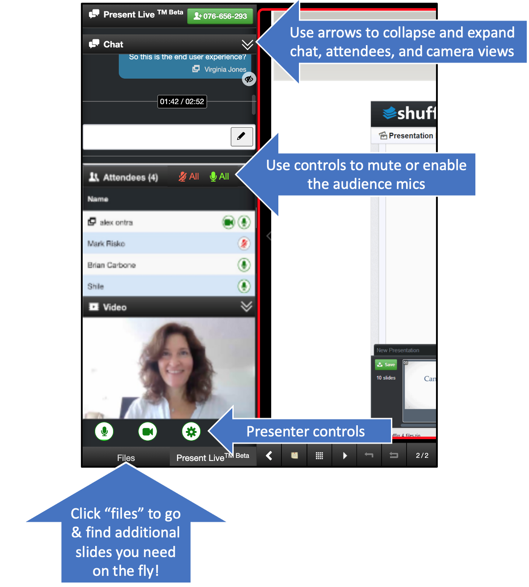
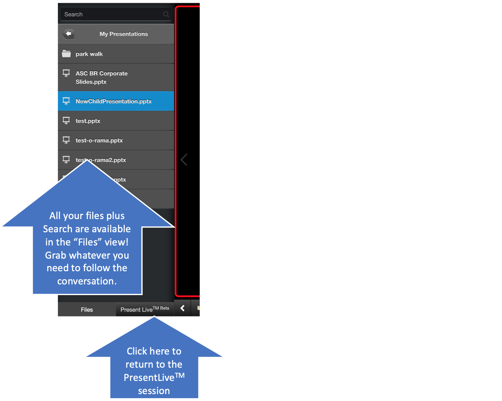
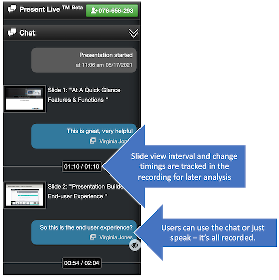

# PresentLive™

<iframe width="560" height="315" src="https://www.youtube-nocookie.com/embed/g2LYjL3JL48" title="YouTube video player" frameborder="0" allow="accelerometer; autoplay; clipboard-write; encrypted-media; gyroscope; picture-in-picture" allowfullscreen></iframe>

## Why use PresentLive™? 

Use PresentLive™ when you want to present Shufflrr slides directly from Shufflrr. You can also present through a broadcast app such as Zoom, Microsoft Teams, or WebEx by playing the slide or file in Shufflrr and sharing your screen.
	
## Steps

* To present a deck, first click the "play" button.
    * You can find this in the top right of the main area of the presentations screen.
    * Or, you can click the three dots next to the filename in the left navigation.
* To broadcast through Zoom, Microsoft Teams, WebEx, or another app, connect to that app, choose Share Screen, and show the Shufflrr slide or file in Play or full-screen mode.
* To use PresentLive™, click the "PresentLive™" button that appears at the bottom of the screen.

* Enter the email of anyone you want to share the presentation with. 

>**Pro Tip!**
> 
> Be sure your camera and microphone are enabled when you go to present! A trial run with a colleague is always a good idea.   

Anyone clicking this link will be brought directly into the presentation "room" with your face on camera - even better than a Zoom screenshare. 

While you are presenting, anyone with the link can enter the presentation "room."

If in the middle of presenting, someone asks a question about content you have not included in the deck, you can click the "files" tab and use search or navigation to find exactly what you need for the moment. 

* During the presentation, people can discuss the presentation aloud, as well as entering comments in the session chat. 
* Anyone with the link can attend, but to post a comment, people must log in. This gives you a record of who commented what during what slide being displayed. 

For more information about accessing PresentLive™ reporting tools, visit [Reports: PresentLive™ Sessions](reports-present-live.md). If you are not an administrator, you'll need to contact your administrator to gain access to these tools.
