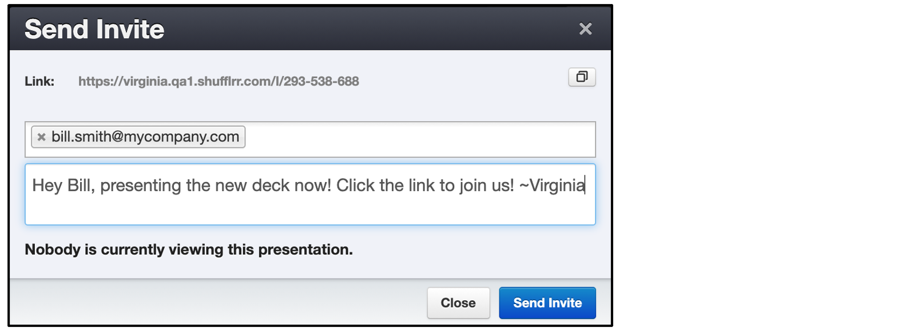
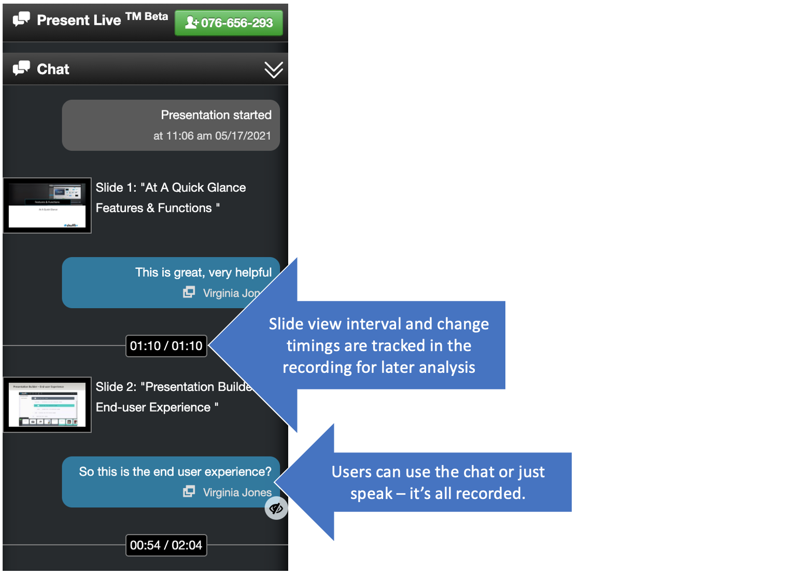

# PresentLive™

## Why use PresentLive™? 

* Present to anyone anytime - better than Zoom.
* Everyone can see the presenter and the presentation
* Sessions are automatically recorded. 
* Plus, you will have reporting data on: 
	* who was in attendance when
	* what slides they saw
	* what their comments were
	
## Steps

* To present a deck, first click the "play" button. 
    * You can find this in the top right of the main area of the presentations screen. 
    * Or, you can click the down arrow next to the filename in the left navigation 
* Then click the "PresentLive™" button that appears at the bottom of the screen.

* Enter the email of anyone you want to share the presentation with. 

>**Pro Tip!**
> 
> Be sure your camera and microphone are enabled when you go to present! A trial run with a colleague is always a good idea.   

Anyone clicking this link will be brought directly into the presentation "room" with your face on camera - even better than a Zoom screenshare. 

While you are presenting, anyone with the link can enter the presentation "room."

If in the middle of presenting, someone asks a question about content you have not included in the deck, you can click the "files" tab and use search or navigation to find exactly what you need for the moment. 

* During the presentation, people can discuss the presentation aloud, as well as entering comments in the session chat. 
* Anyone with the link can attend, but to post a comment, people must log in. This gives you a record of who commented what during what slide being displayed. 

For more information about accessing PresentLive™ reporting tools, visit [Reports: PresentLive™ Sessions](reports-present-live.md). If you are not an administrator, you'll need to contact your administrator to gain access to these tools.