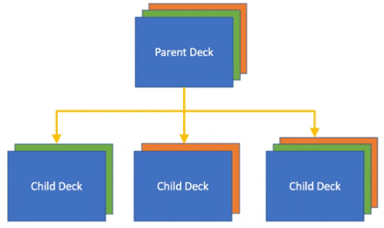

# Parent-Child Relationships

Parent-Child relationships are a core feature of an effective Presentation Management System like Shufflrr. 

A "Child" presentation is a presentation that was created from the slides of another ("Parent") presentation. The relationship is maintained: when the parent updates, the child updates (unless updates are explicitly rejected). 

This allows consistent compliance, branding, and product information to be distributed across multiple child presentations across the organization. 

<iframe width="560" height="315" src="https://www.youtube-nocookie.com/embed/Z-U3JQf8QeE" title="YouTube video player" frameborder="0" allow="accelerometer; autoplay; clipboard-write; encrypted-media; gyroscope; picture-in-picture" allowfullscreen></iframe>

>**Pro Tip!**
> 
> Have SMEs create parent and maintain presentations. Reps in sales or in the field can make child decks that will always stay updated! 

This is one of the most useful features of a Presentation Management System. 

