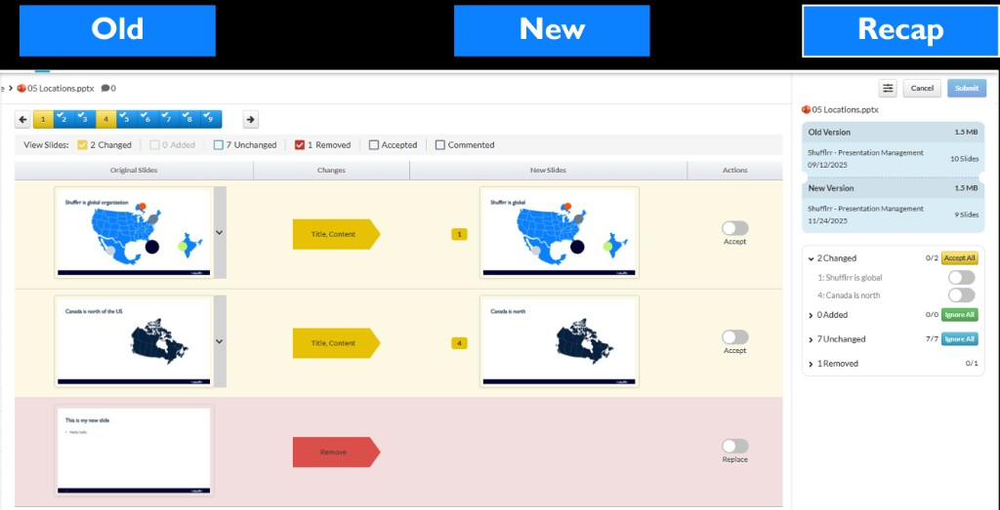

# Slide Updating

Slide updating lets you distribute approved updates from a parent presentation to child presentations across your organization. This feature is available in **Shufflrr Enterprise**.

To trigger Shufflrr's auto-update workflow, upload the revised file with the **exact same file name** in the **same folder**.

## How to update a slide in Shufflrr

1. Upload the new file using the same file name, in the same folder (standard overwrite behavior).
2. Shufflrr recognizes the file as an updated version and compares the old and new versions.
3. Review the side-by-side, slide-by-slide comparison. Shufflrr marks changes by color:
   - **Yellow**: text changed on a slide
   - **Green**: new slide
   - **Red**: removed slide
   - **Blue**: no change

4. Accept or ignore each slide change.
5. Submit the approved updates to distribute them across child presentations in Shufflrr.
6. Choose your rollout mode:
   - **Force update**: updates are applied automatically to child decks.
   - **Manual update**: users choose whether to apply the new slide updates.

> **Tip:** Keep file names identical for reliable version tracking and update propagation.

