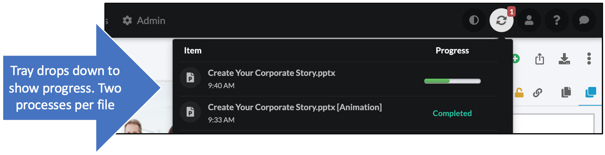

# Uploading

## Why upload material? 

* Maintain a central library of all your corporate slides. 
* Maintain centralized branding, messaging, accuracy, oversight, confidentiality, compliance. 
* Use existing material to make new decks without duplication of effort. 
* Uploading, organizing, and publishing enterprise assets are the key components of Presentation Management!

## Steps

Once your folder structure is created, you can begin uploading the central library decks.
* The better your content, the better your results! [Check here](start-onboarding.md#gettingcontent) for some tips on gathering great content for the slide library. 
* You can upload decks in different ways from different places
	* From the home page, select the folder in the dropdown, then use one of the options to upload folders or individual files.

* From the "presentations" tab, go to the folder where you want to upload the presentation. Either click "upload" in the top bar or, select the sub-folder and click the down arrow. 
	

	
	
* File uploading takes a few minutes for processing. Here's how to track that: 
    * You will see arrows going in a circle at the top right of the screen with a little number showing the number of files being processed.
    

* Click that icon to see the status of your files. 
* Each file goes through two processes: the initial upload and the animation/editing preparation. Those will show on separate lines. 

    
    
* When the first process is finished, you will be able to see the deck in the left navigation and click on it. 
* You will be able to move or delete slides at this point, but not edit slides until the second process has finished. 
* When slides are ready, a blue "Edit" button will appear. Click it to modify the slides.  

> **Pro tip:** 
>
> Accidentally put the folder or file in the wrong place? Click the down arrow next to the file or folder name for the option to move it. Select the new parent folder. 
