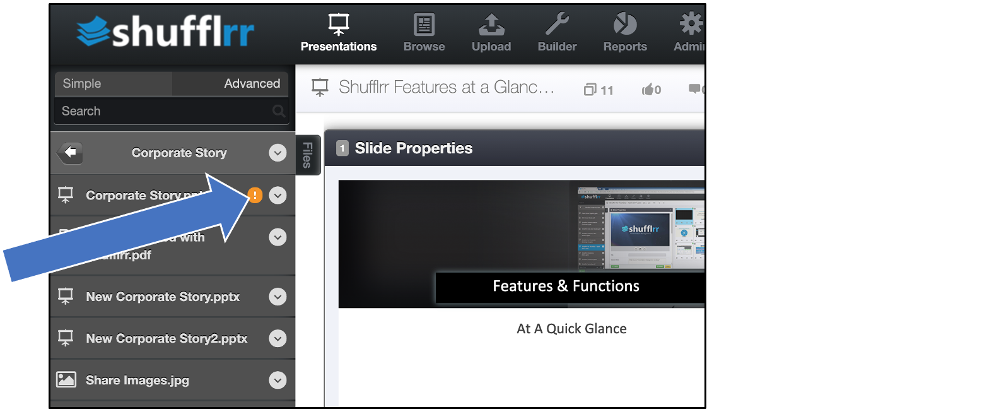
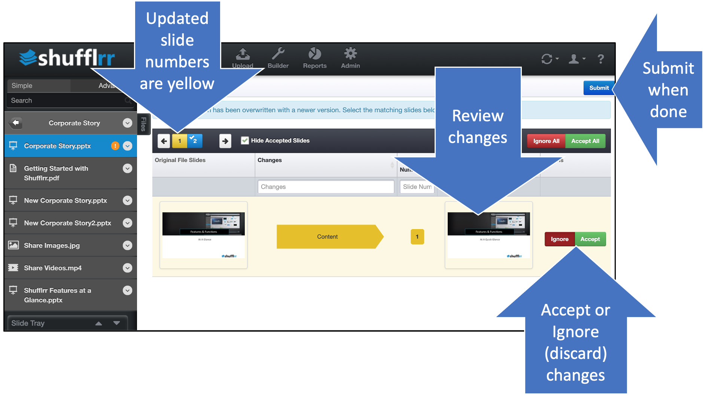

# Parent-Child Updates

<iframe width="560" height="315" src="https://www.youtube-nocookie.com/embed/TqjmJp9oQbY" title="YouTube video player" frameborder="0" allow="accelerometer; autoplay; clipboard-write; encrypted-media; gyroscope; picture-in-picture" allowfullscreen></iframe>

## Why propagate parent updates into child decks? 

* Version Control (accepting/rejecting parent changes in child decks) is key to Presentation Management.
* With version control, you can maintain downstream consistency with corporate changes such as 
	* Product information
	* Compliance text
	* Branding and styling 

## Why reject changes? 

* You may want to manually make updates to branding, if, for example, font changes cause  issues with text fitting on the slide. 
* The parent updates might not be relevant to you. 
* Parent updates might have been made in error.

>**Pro tip!**
> 
> Rejecting parent changes permanently breaks the link between parent and child slides. 

## Steps

If the parent of one of your decks has been edited, an orange circle with an exclamation point will appear next to the name of the deck.

* Click on the name to review and accept or reject the parent changes.   
* You will be able to see how the changes affect your work, and accept or reject on a slide by slide basis. 
* You can also accept all or reject all at the top right. 

If you need more details on what has changed, hover over the yellow arrow. 

