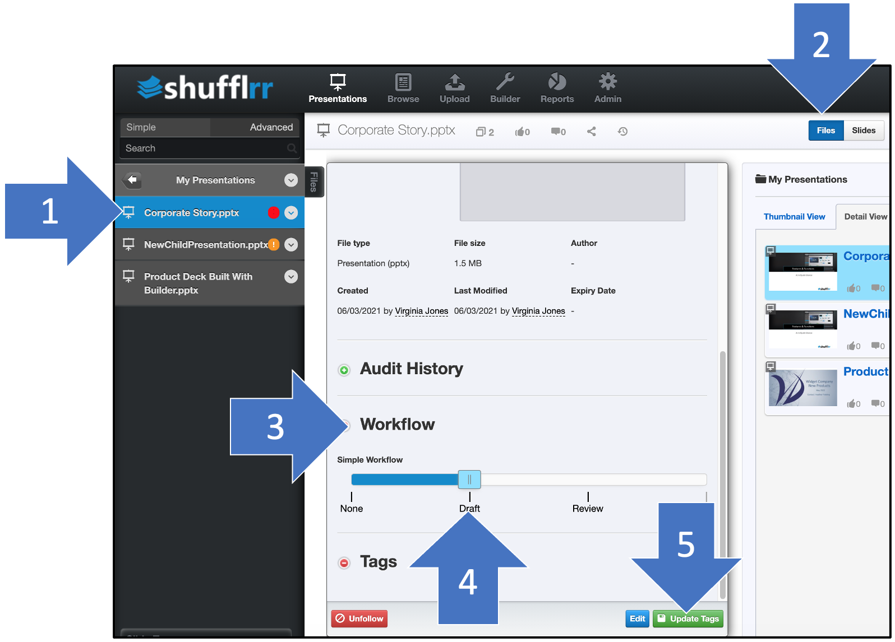

# Using Workflows

<iframe width="560" height="315" src="https://www.youtube-nocookie.com/embed/3ZScvX6ZvP8" title="YouTube video player" frameborder="0" allow="accelerometer; autoplay; clipboard-write; encrypted-media; gyroscope; picture-in-picture" allowfullscreen></iframe>

## Why use workflows? 

Use workflows to pass files from - for example - creator to compliance to presenter. The admin for your organization has defined the available workflows and will inform you as to how your work should pass from stage to stage. 

## Setting a workflow stage when saving a file

When saving a file, you can check the box for the workflow you want, and slide the slider to the correct stage. 

## Moving a file to a different workflow stage

When you are ready to change the workflow stage, for example, to send it to compliance for review, do the following steps: 

1. Click the file you want to update
2. Click the "files" slider at the top of the screen
3. Scroll down in the editing window and open the "Workflow" section
4. Move the slider to the correct stage
5. Click "Update Tags" at lower right. 

Note: ***IF*** this deck is a parent of children, then, at this point you will be prompted to indicate whether the child slides from this deck should also be updated with the new workflow status. Select whether to Ignore (don't update the child slides) or Accept (do update child slides) and click "Submit". For more information see [Parent-Child Updating](presentations-version-control.md).

## Adding comments when moving a file to a different workflow stage

This works the same way as above, except that before saving, you also need to open the "Audit History" and enter comments. Then click either green button to save. 

1. Click the file you want to update. 
2. Click the "files" slider at the top of the screen
3. Scroll down in the editing window and open the "Audit History" section
4. Enter comments
5. Move the slider to the correct stage
6. Click "Update tags" at lower right. 

Notice that it has moved to the Marketing folder and the indicator is green, per what was specified. 

