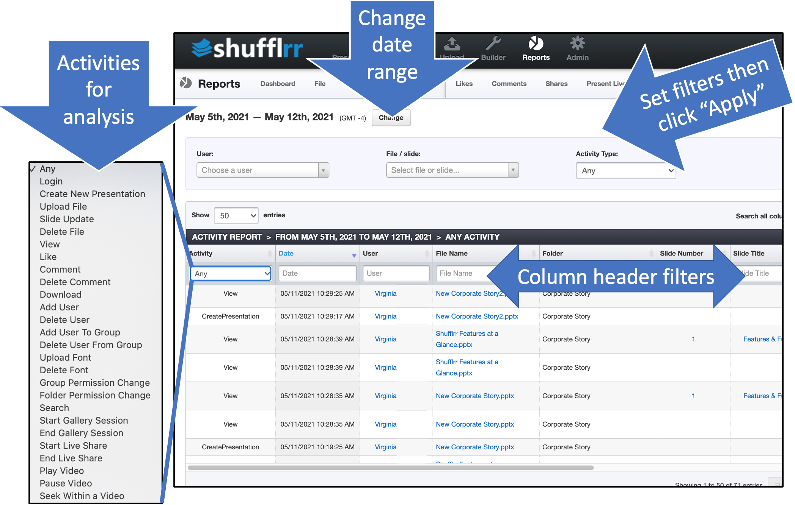

# Reports: Activity

## Why use the "Activity" report? 
Part of Presentation Management is reporting: tracking what works and what can be improved. 

The activity report can tell you about: 
* Volume of different activities (are users sharing files? making files? presenting to an audience?)
* Users performing specific activities (who is doing what most often?)

>**Pro tip!**
>
> Identify activities of your most successful users and train others in best practices!
## Steps

Click the "Reports" icon and the "Activity" tab.

* The dropdowns along the top are filters; set them up and click "Apply" to add them.
* The column header filters can also be used to narrow down what you want to look at. 
* Click "Change" at top left by the dates to select a different date range. 

