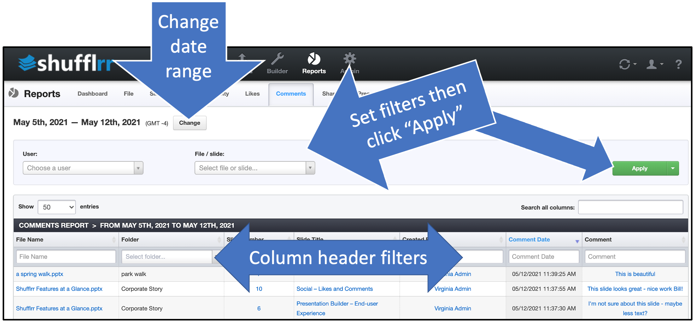

# Reports: Comments

## Why use the Comments report?

Part of Presentation Management is reporting: tracking what works and what can be improved.

The Comments tab tells you how people in your system are collaborating with one another, sharing best practices and feedback. 

>**Pro tip!**
>
> Encourage collaboration by providing positive feedback to users who are commenting on each other's work! 

## Steps

Click the "Reports" icon and the "Comments" tab.

* The dropdowns along the top are filters; set them up and click "Apply" to add them.
* The column header filters can also be used to narrow down what you want to look at. 
* Click "Change" at top left by the dates to select a different date range. 

