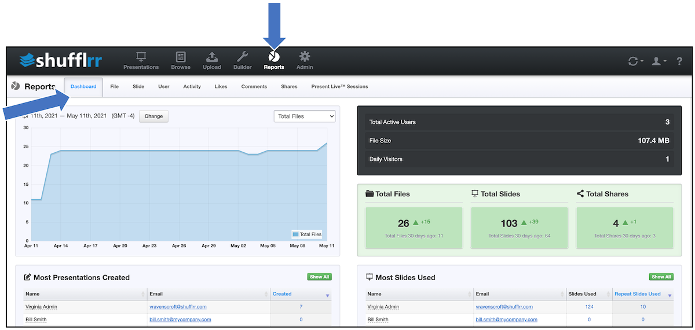

# Reports: Dashboard

## Why use the dashboard?

Part of Presentation Management is reporting: tracking what works and what doesn't. With reporting you can find out what slides sell, what slides get used by your experts in the field, what slides are seen as most compelling by users. The dashboard is your first stop in reporting. 

## Steps

Click the "Reports" tab then "Dashboard." Here you can see site-level data for your whole enterprise on Shufflrr, including for example,  
* Total file size, total number of files, total number of slides, shares, and users
* Total daily visitors, views, and downloads
* The change in the last thirty days in the number of files, slides, and shares
* Who in the system is creating the largest number of presentations and using the largest number of slides
* Which of your enterprise slides are most popular (most often used) among your users
* Which files are most downloaded

> **Pro tip!**
> 
> Change the date at the top left to see data for a different range displayed in the graph. 