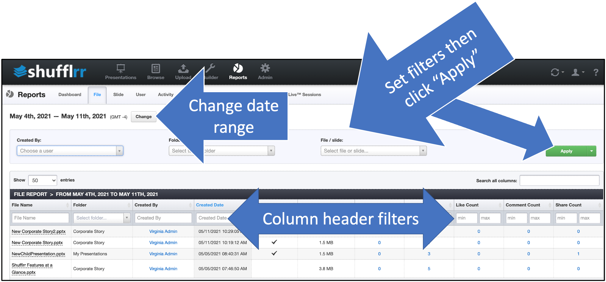

# Reports: File

## Why use the "File" report?

Part of Presentation Management is reporting: tracking what works and what can be improved.

The file tab tells you how files in your enterprise Presentation Management system are being used. 

## Steps

Click the "Reports" icon and the "File" tab.

* The dropdowns along the top are filters; set them up and click "Apply" to add them.
* The column header filters can also be used to narrow down what you want to look at. 
* Click "Change" at top left by the dates to select a different date range. 

