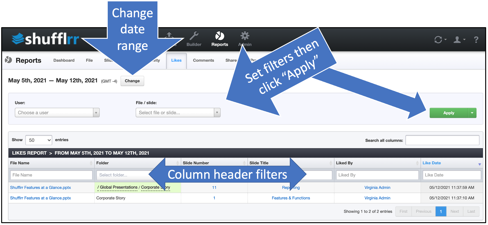

# Reports: Likes
## Why use the "Likes" report?

Part of Presentation Management is reporting: tracking what works and what can be improved.

The "Likes" tab tells you how people in your system are communicating with each other about their work. 

>**Pro tip!**
>
> Encourage users who are liking each other's work! Collaboration is key. 

## Steps

Click the "Reports" icon and the "Likes" tab.

* The dropdowns along the top are filters; set them up and click "Apply" to add them.
* The column header filters can also be used to narrow down what you want to look at. 
* Click "Change" at top left by the dates to select a different date range. 

