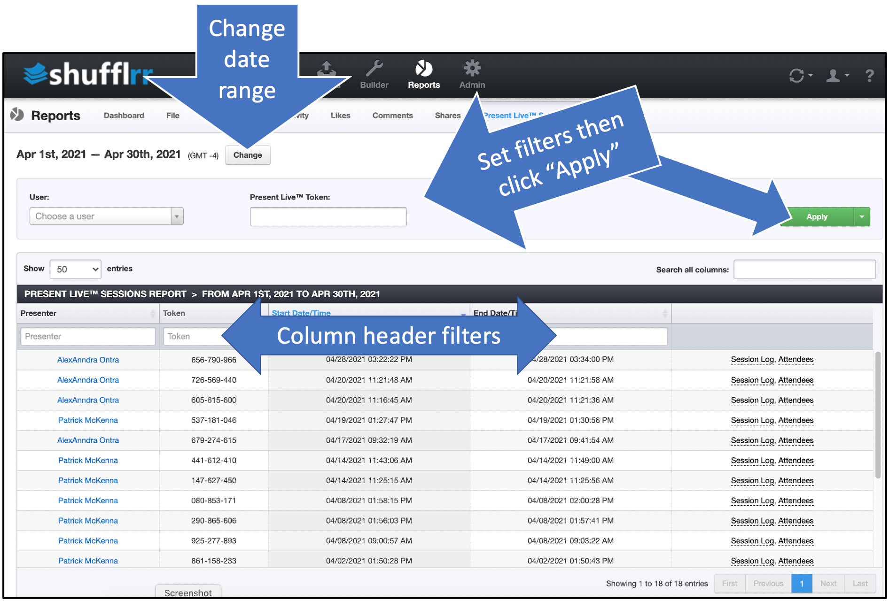
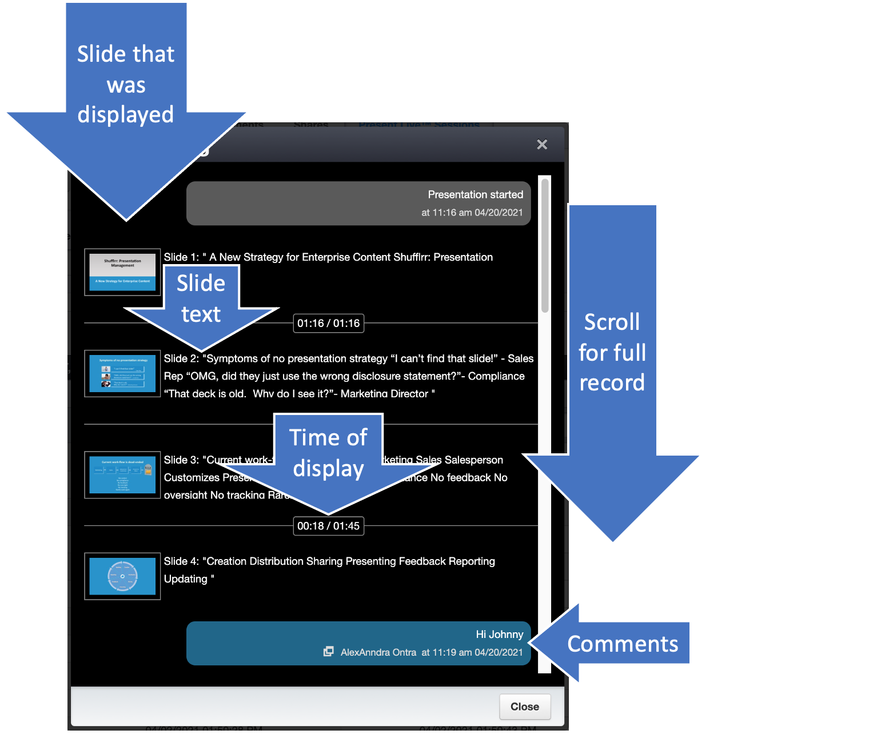
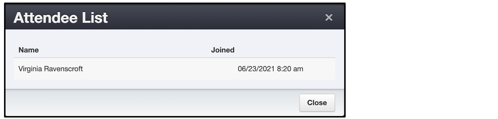

# Reports: PresentLive™ Sessions

## Why use the "PresentLive™ Sessions" report?
* Determine best practices: Check out how your most successful sales and marketing people are utilizing PresentLive™ to improve their efficacy
* Research for compliance purposes: who saw what when?
* Review audience discussion and feedback after a presentation

## Steps

Click the "Reports" icon and the "PresentLive Sessions" tab
* View who presented, what they presented, and when
* Use filters to find a specific user, deck, or session
* Change the date range to view another time period

The last column contains links to the session log and to a list of attendees. 

* The session log shows the time each attendee joined, the exact slides shown, their content, the time they were shown, and all the audience chat/comments. 

* The attendees list shows both the attendees and the time they joined the session.

