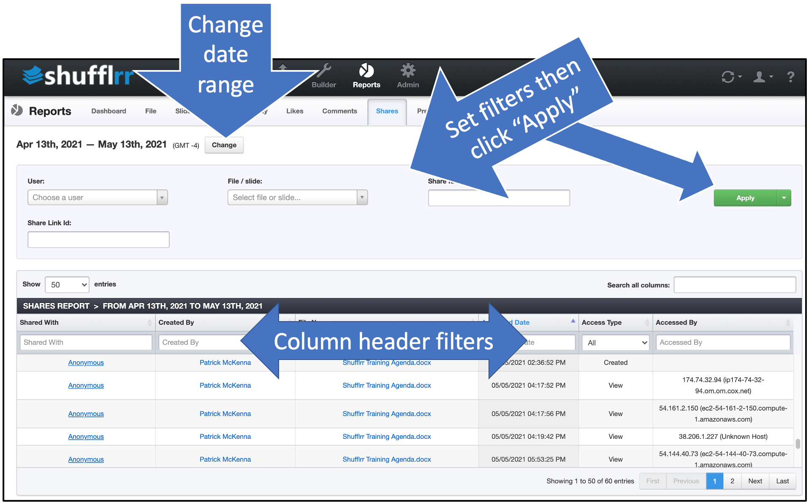

# Reports: Shares

## Why look at the Shares report? 

Part of Presentation Management is reporting: tracking what works and what can be improved.

In the Shares report, you can see if the people you sent files to opened them, played them, and/or shared them with others. 

## Steps

Click the "Reports" icon and the "Shares" tab.

* The options along the top are filters; set them up and click "Apply" to add them.
* The column header filters can also be used to narrow down what you want to look at. 
* Click "Change" at top left by the dates to select a different date range. 

>**Pro tips!**
>
> * Go to <a href="https://ipinfo.io/" target="blank">IP Info</a> to identify the owner of the IP address in the last column.
> * Clicking the "Accessed Date" column header to show the dates in ascending order displays the creation of the file first, before any accessing of the file, which helps understand timelines. 

