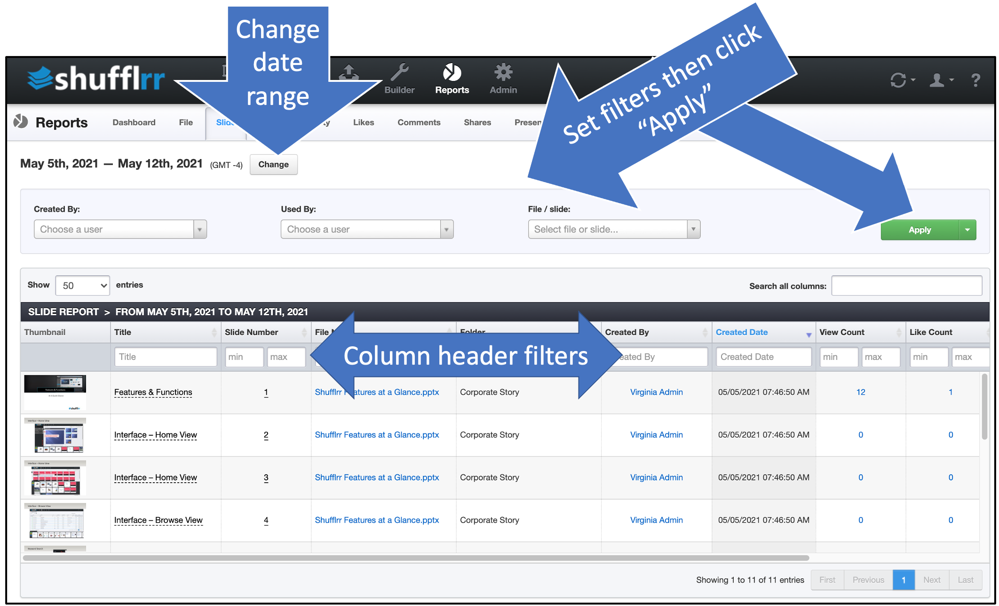

# Reports: Slide

## Why use the Slide report?

Part of Presentation Management is reporting: tracking what works and what can be improved.

The slide tab tells you how about the creation of new slides in your Presentation Management system. 

## Steps

Click the "Reports" icon and the "Slide" tab.

* The dropdowns along the top are filters; set them up and click "Apply" to add them.
* The column header filters can also be used to narrow down what you want to look at. 
* Click "Change" at top left by the dates to select a different date range. 

>**Pro tip!**
> 
> Some of the most useful columns in the Slide report are on the right - scroll to see whether the new slide is being seen and used. 

