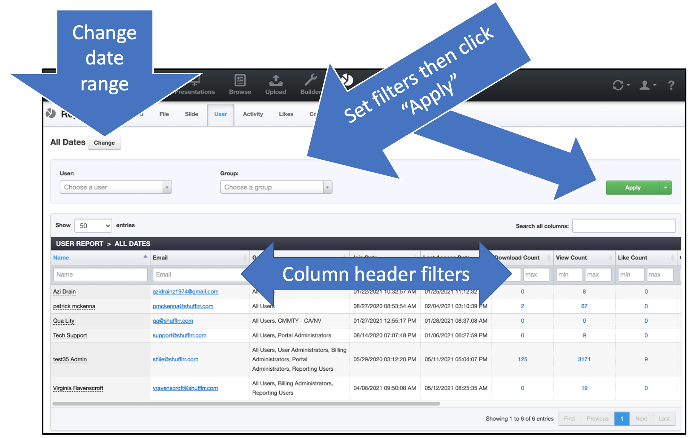

# Reports: User

_Part of Presentation Management is reporting: tracking what works and what can be improved._

## Why use the "User" report?

The User tab tells you how users in your system are interacting with your enterprise assets in Shufflrr. Are they uploading slides? Liking and commenting? Sharing with prospects? 

>**Pro tip!**
>
>See how your top sales and marketing team members use Shufflrr, then recommend those activities to others as best practices!

